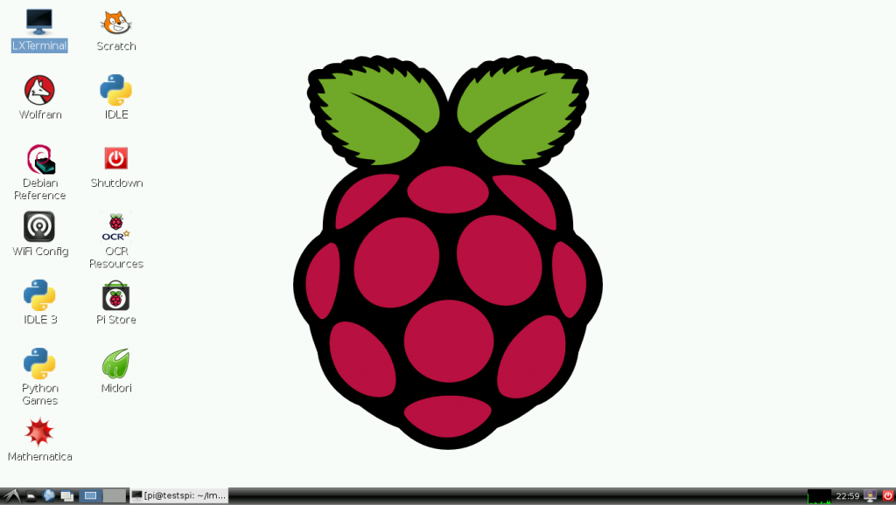

# 2. S.O. no Raspberry

Sistemas Operacionais (S.O.) podem ser definidos como uma coleção de programas que atua como uma interface entre os programas do usuário e o hardware. Sua maior finalidade é proporcionar um ambiente em que o usuário de um microsistema possa executar programas no hardware de forma eficiente. São atribuições de um SO:

1. Gerenciar recursos e dispositivos I/O;
2. Oferecer uma simples interface para aplicativos e usuários.

A Raspberry Foundation, em seu site, enumera alguns dos [Sistemas Operacionais](https://www.raspberrypi.org/downloads/) mais utilizados e conhecidos com suporte ao Raspberry Pi.

## 2.1 Raspbian

O Raspbian é o Sistemas Operacional oficial distribuído pela [Raspberry Pi Foundation](http://www.raspberrypi.org/). Esta é a distribuição ideal para quem tem menos conhecimentos dos sistemas Linux ou simplesmente necessite de um sistema operacional pronto. O Raspbian é um sistema quase completo, já que vem com diversas aplicações pré-instaladas, os drivers mais usuais, ferramentas para facilitar algumas configurações necessárias. Muitas aplicações e módulos dedicados à programação também já vêm incluídos na imagem do Raspbian.

Para iniciantes com o Rpi que desejam experimentar as potencialidades ou começar a programar e desenvolver projetos de sistemas embarcados, o Raspbian é o mais recomendado. A Figura 3 mostra a tela gerada pelo Raspberry para interface com o usuário.

Figura 3: Tela gerada pelo Raspberry Pi.

## 2.2 Minibian

Como alternativa ao Raspbian, o [Minibian](https://minibianpi.wordpress.com/) (**MINI**mal rasp**BIAN**) oferece uma versão enxuta do Raspbian, como forma de tentar um melhor proveito dos recursos. Sua utilização é possível em cartões de apenas 1 GB de memória, enquanto o Raspbian ocupa 4 GB. Para projetos de eletrônica, robótica, servidores, onde não são necessários todas as aplicações instaladas no Raspbian, Minibian surge como uma boa alternativa. [Mais detalhes podem ser encontrados em sua sessão específica](minibian_minimal_raspbian.md).
