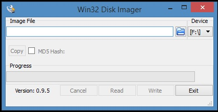
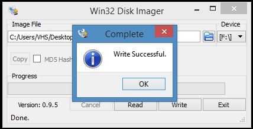

# 3.2 Transferência do Sistema Operacional para o cartão

Após fazer o download do Sistema Operacional Raspbian, instale o . O utilizaremos para transferir a imagem do SO baixada para o SD card.

1. Baixe o **[Win32DiskImager](https://sourceforge.net/projects/win32diskimager/)**;
1. Execute-o como administrador: Clique sobre ele com botão direito e selecione _Abrir como administrador_;
1. O programa será aberto (_Figura 6_);
1. Em _Device_, **assegure-se** que a opção selecionada seja a correspondente ao seu cartão SD;
1. Clique no ícone com a imagem de uma pasta  e escolha o arquivo ```*.img``` dentro da pasta para onde extraiu o Sistema Operacional. Caso ainda não tenha extraído o Sistema;
1. Clique no botão **Write**, aceite o aviso na janela seguinte e aguarde o término da operação (ver Figura 6). Este processo irá levar alguns minutos.


<center>Figura 5: Win32DiskImager.</center>


<center>Figura 6: Confirmação de gravação da imagem no cartão SD.</center>
