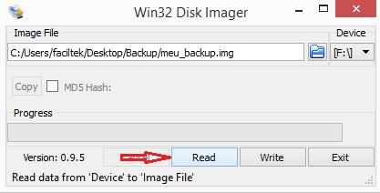

## 4.1 Criação do arquivo de imagem do sistema

 1. Caso não tenha instalado o **Win32 Disk Imager**, [baixe-o]([Win32 Disk Imager](http://sourceforge.net/projects/win32diskimager/) e instale.
 1. Coloque o cartão com o Sistema Operacional do seu _Raspberry Pi_ no leitor de cartões do seu PC.
 1. Inicie o **Win32 Disk Imager** como administrador:
    1. Clique com o botão direito do mouse no ícone do programa;
    1. Selecione a opção _Executar como Administrador_.
 1. O programa será aberto e sua tela inicial será exibida, conforme ilustrado na Figura 7;
 1. Em **Device**, selecione a letra correspondente ao seu cartão SD do qual queira fazer backup;
 1. Clique no ícone com uma pasta  e;
    1. Selecione uma localização para guardar o arquivo a ser criado
    1. atribua-lhe um nome e clique em “_Abrir_“ (Figura 8).
 1. Clique no botão **Read** (Figura 9), confirme e aguarde o processo ser concluído.
 

Figura 7: Win32 Disk Imager.

Figura 8: Abrir local do arquivo.

Figura 9: Concluir backup.

Um arquivo de imagem estará salvo na pasta selecionada com o nome dado.
