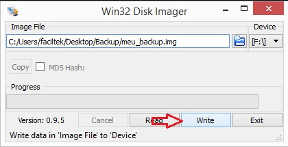

## 4.2 Instalação do arquivo de imagem no Cartão

A instalação de arquivo de imagem pode ser realizado conforme os passos descritos na sessão de [Instalação](3.0 Instalação.md). Entretanto, deve-se estar atento a escolher o Arquivo de backup, conforme ilustra o campo **Image File** na Figura 10.

Figura 10: Escrever imagem no cartão SD.

