# 5. Minibian (**MINI**mal rasp**BIAN**)

O [**Minibian**](http://minibianpi.wordpress.com/) é uma versão “enxuta” do **Raspbian**. Destina-se àqueles que precisam de um sistema o mais leve possível e sem ferramentas e aplicações desnecessárias.

O **Minibian** é excelente, por exemplo, para projetos de eletrônica, robótica, servidores e outros já que deixa livres no **Raspberry Pi** o máximo de recursos possível como memória, processador, consumo de corrente, etc.

Esta distribuição não traz sequer GUI (o ambiente de janelas) e cabe num cartão de apenas 1GB que hoje em dia já não serve para muita coisa e muitas vezes temos uns quantos sem uso lá por casa.

****Se precisa de um sistema leve ou quer construir o seu próprio, o Minibian (****Figura 11****) é uma opção viável.****

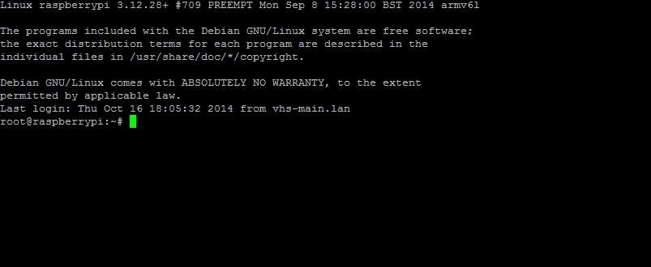

Figura 11: Minibian.

Download:  [http://sourceforge.net/projects/minibian/](http://sourceforge.net/projects/minibian/)

*   1.  Acesso Remoto SSH (Secure SHell) por linha de comando

É possível utilizar o protocolo SSH, _default_ no Raspbian, para acessar o Raspberry Pi de um computador remoto é necessário que através de um programa, como o Putty, conectado na porta 22\. O Putty é um programa de fácil execução, sendo necessário somente inserir o IP do Rpi, além de satisfazer qualquer usuário. Para fazer download do programa clique no link [http://www.putty.org/](http://www.putty.org/).

*   1.  Acesso a um Raspberry remoto por interface gráfica

Gerenciar um Raspberry Pi (Rpi) por linhas de comando, através de interface SSH como o programa Putty, é uma forma eficiente de acesso remoto. Caso seja necessário utilizar interface gráfica, uma das melhores formas é o protocolo VNC (_Virtual Network Computing_) através do programa tightvnc.

Existem vários projetos de software que suportam VNC. O TightVNC foi escolhido porque é software livre de código aberto (GPL2) que fornece compressão para permitir que ele trabalhe sobre redes lentas de Internet e está prontamente disponível nos repositórios de software (sudo apt-get install tightvncserver). Mais detalhes em [http://sanusb.org/vnc/vncportugues.html](http://sanusb.org/vnc/vncportugues.html) .

O VNC segue o modelo cliente-servidor tradicional. O software do servidor é executado no host e software cliente é executado na máquina local que deseja controlar o host.

*   1.  Instalando o software do servidor TightVNC

Primeiro é recomendável atualizar as informações do repositório de software digitando no terminal:

| **_sudo apt-get update_** |
| --- |

Instale o software do servidor a partir dos repositórios **como usuário pi (sem ser usuário root, ou seja, sem digitar sudo su)**. Se estiver como root, basta digitar _exit_ no terminal.

| **_sudo apt-get install tightvncserver_** |
| --- |

*   1.  Iniciando o servidor e configurando uma senha

A primeira vez que executar o servidor digitando o código abaixo no terminal, irá pedir para definir uma senha de 8 dígitos. Esta é a senha utilizada para se conectar remotamente.

| **_/usr/bin/tightvncserver_** |
| --- |

Quando o servidor começa ele vai dizer que o desktop virtual foi configurado. Neste caso:

_New 'X' desktop is raspberrypi:1_

Mostra que o desktop é o virtual 1\. É possível se conectar a esse Desktop virtual utilizando :1 no fim do endereço IP do cliente. Este número é o que irá ser configurado para a inicialização automática depois, sendo que para inicialização automática será o Desktop virtual :2.

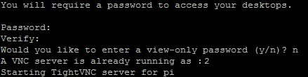

Cada vez que se inicia o tightvncserver, ele captura o próximo Desktop disponível, que no nosso caso remoto automático será o 2, mas em outros casos, pode ser o 1\. Quando for requerido uma senha durante a instalação, digite uma senha de 8 dígitos no terminal como, por exemplo 12345678\. Essa senha será a mesma utilizada quando conectar no cliente Windows.

Para instalar o tightvnc no computador cliente Windows, basta baixá-lo em TightVNC.com. Após instalar o cliente Windows, aparecerá a interface da Figura 12.

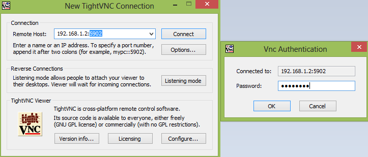

Figura : TightVNC.

Note que a porta VNC é 5902, ou seja, o desktop virtual instalado será o 2\. Ao clicar em Connect, basta digitar a mesma senha cadastrada na instalação no Rpi (12345678). Para modificar o Desktop virtual basta digitar **_tightvncserver_** no terminal SSH, como usuário pi, e será mostrado qual o Desktop disponível para conexão no cliente Windows;

*   1.  Script de instalação automática do tightvnc para inicialização automática

Para ter a inicialização automática do tightvnc, é possível executar os seguintes passos para instalação como usuário pi (sair do modo root –> exit):

| pi@raspberrypi ~ $ **_sudo wget sanusb.org/arquivos/VncConfig.sh_** (baixar o script de instalação) |
| --- |

****

Abaixo o script _VncConfig.sh_.

| _#!/usr/bin/env bash_ |
| --- |

Para instalar manualmente basta seguir passo a passo as linhas comando abaixo:

| **_wget http://sanusb.org/vnc/tightvncserver-init.txt_** |
| --- |

A partir das linhas de comando abaixo, scripts ou arquivos binários podem ser configurados para tornar-se Default no Raspbian:

| **_sudo mv tightvncserver-init.txt /etc/init.d/tightvncserver_** |
| --- |

A variável da linha 23, que define o Desktop virtual, foi configurada como :2, ou seja, na porta 5902\. O valor original é :1

Altere o arquivo para que ele seja de propriedade root (é a propriedade padrão para arquivos de inicialização):

| **_sudo chown root:root /etc/init.d/tightvncserver_** |
| --- |

Permita que o arquivo seja executável:

| **_sudo chmod 755 /etc/init.d/tightvncserver_** |
| --- |

Adicione o comando abaixo para habilitar a execução no início do sistema operacional:

| **_sudo update-rc.d tightvncserver defaults_** |
| --- |

O TightVNC está instalado e vai ser carregado na inicialização do Raspbian. Neste momento, é recomendado a reinicialização (_reboot_) para se certificar de que está funcionando, mas é possível simplesmente parar e iniciar manualmente digitando:

| **_sudo /etc/init.d/tightvncserver stop_** |
| --- |

*   1.  Mudar senha do VNC

**O VNC só aceita senha com oito caracteres, caso seja digitada uma senha com mais de oito caracteres o vnc irá considerar somente os oito primeiros.**

| **_pi@_**raspberrypi ~ $**_vncpasswd_** |
| --- |

Descrevendo a instalação do servidor SAMBA

O SAMBA é um servidor de arquivos remotos compatíveis como Windows. Com ele é possível compartilhar arquivos com o Windows e até criar um controlador de domínios. Para essa instalação iremos usar como sistema operacional no Raspberry Pi o Raspbian, a versão embarcada do Debian.

Para não ter que ficar usando o ‘sudo’ a cada comando digite:

| **sudo bash** ou **sudo su** |
| --- |

Para instalar automaticamente, execute o script em sanusb.org/arquivos/SambaBlink.sh . Para instalar manualmente pelo terminal, atualize a lista de pacotes e _mirror_ do apt-get usando o comando:

| **apt-get update** |
| --- |

Aguarde. Essa operação pode levar vários minutos. Digite a seguinte linha de comando para baixar o SAMBA:

| **apt-get install samba samba-common-bin** |
| --- |

Confirme a instalação quando solicitado.

Vamos configurar um compartilhamento, usaremos o sub-diretório home para isso.

Crie o sub-diretório share dentro do diretório home:

| **mkdir /home/share/** |
| --- |

Dê permissões totais para sua pasta share ( digitar **cd /home**):

| **chmod 777 share** |
| --- |

Note que esse tipo de ação pode comprometer a segurança do seu sistema, válido apenas para testes gerais e fins didáticos.

Crie uma cópia de segurança do arquivo de configurações original do samba. Com isso em qualquer necessidade podemos voltar às configurações originais:

| **cp /etc/samba/smb.conf /etc/samba/smb.conf.old** |
| --- |

Edite o arquivo /etc/samba/smb.conf:

| **nano /etc/samba/smb.conf** |
| --- |

Vá com o cursor até o final do arquivo **smb.conf** e insira as seguintes linhas:

| [share] |
| --- |

Depois salvar o aquivo: **Ctrl+X -> Yes -> &lt;Enter&gt;**

Com isso foi criado um compartilhamento chamado share que dará acesso irrestrito aos arquivos lá constantes utilizando o Samba (http://www.samba.org).

Agora reinicie o serviço para que a nova configuração seja efetivada (Figura 13):

| **service samba restart** |
| --- |

Figura 13: service samba restart.

Agora se o computador estiver no Windows, abra o Windows Explorer e na barra de endereços digite \\endereço ip do Raspberry\share, por exemplo: \\192.168.1.3\share e adicione ou visualize arquivos compartilhados com o Raspberry (Figura 14).

Figura 14: Arquivos compartilhados na pasta _share_.

Veja como acessar o Raspberry Pi na Figura 15.

Figura 15: Acesso ao Rpi.

*   1.  Criar senha para acesso ao Samba

É importante criar uma senha de acesso à pasta _share_, de forma que somente o usuário autorizado poderá visualizar e trabalhar com os arquivos. O passo a passo é descrito a seguir:

| **Criar usuário válido e senha para o Samba (exemplo de usuário: laese)** |
| --- |

*   1.  Copiar arquivos do PC para o Raspberry Pi com Filezilla e vice-versa

Uma das melhores ferramentas é utilizar o SSH _File Transfer Protocol_ ou SFTP (Figura 16). Nesse caso, SSH significa _Secure Shell_). Para isso, se utiliza o Filezilla com configuração mostrada na figura abaixo a apartir do IP do Rpi na rede. Nesse caso, o Host é o IP, o Nome do usuário é pi, a senha é raspberry e a Porta SFTP é 22.

Figura 16: Filezilla.

Há uma série de programas que você pode baixar para ajudá-lo com isso, mas é recomendado o FileZilla.

Conhecendo/revendo os principais comandos Linux para usar no Raspberry Pi

*   1.  ****Listagem de Arquivos e Movimentação**** 

#### Localização atual {#localiza-o-atual}

O primeiro dos comandos Linux que vamos apresentar é o comando ‘**pwd**‘. Ao abrir o terminal, queremos saber em que ‘pasta’ estamos a navegar. Este comando mostra-lhe em que diretório se encontra atualmente na navegação.

*   No terminal introduza o seguinte comando: pwd

Poderá ver o caminho para o diretório onde se encontra na navegação (Figura 17).

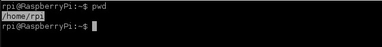

Figura 17: Localização atual no Rpi.

*   1.  **Listagem de arquivos e diretórios**

O comando para listar o conteúdo da diretoria em que se encontra é ‘**ls**‘.

- No terminal introduza o comando:

| **ls** |
| --- |

Surgirá uma listagem com o conteúdo da sua localização atual (Figura 18).

Pode ver todas as ‘pastas’ (chamadas normalmente de diretórios no Linux) e arquivos que se encontram nessa localização.

Figura 18: Arquivos locais.

*   1.  Navegação – Endereços absolutos

Para navegar para outras localizações, o comando Linux utilizado é ‘**cd**‘ seguido da localização para onde quer navegar.

A raíz do sistema é representado por uma barra no início do caminho especificado ‘**_/_**‘.

- Navegue para a raiz do sistema com o seguinte comando:

| cd / |
| --- |

- Para conferir onde se encontra, utilize novamente o comando ‘**pwd**’ (Figura 19).

| pwd |
| --- |

Verá que se encontra em ‘**/**‘ (raíz do sistema) .

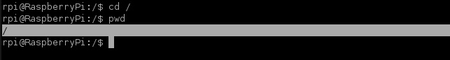

Figura 19: Raiz do Rpi.

Se quiser ir para a sua pasta desejada que se encontra normalmente em ‘/home/pastadesejada‘, terá que utilizar o comando:

| cd /home/pastadesejada |
| --- |

Para saber o seu nome da pasta atual digite o comando ‘**whoami**‘.

- Com estes comandos já será capaz de navegar entre pastas, saber a sua localização e listar o conteúdo dos diretórios.

Assim  foi aprendido como navegar pelo sistema Linux utilizando o comando ‘**_cd_**‘ seguido de um **endereço absoluto** do tipo ‘**_/home/pastadesejada_**‘.

São chamados **endereços absolutos** porque está a indicar um caminho completo a partir da raíz ‘**_/_**‘.

Outra forma de navegar é utilizando caminhos relativos ao diretório em que se encontra.

****Vamos ver um exemplo:****

 **- Endereço relativo – Subir um nível**

  – No terminal digite o comando ‘**cd /**‘ para ir para a raiz.

| cd / |
| --- |

Vamos agora até à pasta desejada, ‘subindo’ um diretório de cada vez em alternativa a introduzirmos o caminho completo como vimos anteriormente.

- Digite agora o comando para ir para o diretório seguinte (/**home**).

| cd home |
| --- |

 Encontra-se agora em ‘/home’ como pode verificar como comando ‘**_pwd_**‘.

 Falta então subir mais um diretório para a pasta desejada. Por exemplo rpi.

- Digite o comando:

| cd rpi |
| --- |

 Novamente com o comando ‘**_pwd_**‘ pode verificar que se encontra em ‘/home/rpi’ (Figura 20).

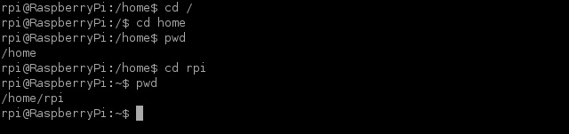

Figura 20: Diretórios Rpi.

*   1.  Endereço relativo – Descer um nível

Para descer um nível a partir da localização atual, o comando Linux que vamos utilizar é ‘**_cd .._**‘.

- No terminal introduza ‘**cd ..**’.

| cd .. |
| --- |

Com o comando ‘**_pwd’_** pode verificar que desceu um nível de ‘/home/rpi‘ para ‘/home’ (Figura 21).

Figura 21: Diretórios Rpi.

Para finalizar pode limpar o terminal com o comando ‘**_clear_**’.

*   1.  ****Criação de diretórios****

****Iremos agora criar um novo diretório na pasta de utilizador e para isso vamos recorrer ao comando:****

| **mkdir** |
| --- |

Para criar um diretório dentro daquele em que se encontra basta introduzir o comando “**mkdir**” seguido do nome do diretório a criar (mkdir nomediretorio).

Também pode criar um diretório indicando o caminho completo do mesmo (mkdir /home/pastadesejada/nomediretorio).

- Comece por navegar até à sua pasta de utilizador com os comandos anteriormente aprendidos.

| cd /home/pastadesejada |
| --- |

- Utilize agora o comando “mkdir” para criar o novo diretório.

| mkdir meudiretorio |
| --- |

 - Com o comando “ls” confirme que o diretório foi criado.

| ls |
| --- |

*   1.  ****Criação de arquivos****

A criação de um novo arquivo é feita através do comando “**touch**” seguido do nome e extensão desejados.

Tal como para os diretórios, também podemos criar arquivos dentro do diretório onde nos encontramos, bastando para isso indicar o nome do arquivo ou fazê-lo indicando o caminho completo para o arquivo (touch /…/nomedapasta/nomedoarquivo).

Note que a pasta onde vai criar o arquivo já tem que existir!

- Navegue até à sua pasta de utilizador e crie um novo arquivo com o comando “touch“.

**touch meuarquivo.txt**

- Com o comando “ls” verifique que o arquivo foi criado.

**ls**

 Depois de aprender [como movimentar-se pela estrutura do sistema operacional](http://faciltek.com/conheca-os-principais-comandos-linux/) e [como criar diretórios e arquivos em Linux](http://faciltek.com/conheca-os-principais-comandos-linux-parte-02/), vamos agora mostrar como pode copiar, mover ou renomar arquivos através da linha de comandos.

**Abra uma sessão no terminal e vamos começar a partir da nossa pasta desejada (/home/pastadesejada).**

*   1.  ****Copiar arquivos****

A cópia de arquivos em Linux é feita através do comando “cp” seguido do nome do arquivo a copiar e do caminho que indica o destino para a cópia.

Se seguiu o [artigo anterior](http://faciltek.com/conheca-os-principais-comandos-linux-parte-03/), deverá ter na sua pasta de utilizador o arquivo “meuarquivo.txt” e o diretório “meudiretorio” que criámos. Vamos utilizá-los neste tutorial.

- Vamos copiar o arquivo “meuarquivo.txt” da sua pasta atual para dentro do diretório “meudiretorio” também na mesma localização através do comando “cp“. (**cp  arquivo_a_copiar destino_da_cópia**).

| **cp /home/pastaatual/meuarquivo.txt /home/ pastaatual/meudiretorio/** |
| --- |

Também pode usar caminhos relativos para este comando, tal como vimos para os comandos “ls” e “cd“, por exemplo.

** - Verifique que o arquivo foi copiado com o comando “ls“.**

| **ls /home/ pastaatual/meudiretorio/** |
| --- |

*   1.  ****Mover e renomear arquivos****

A forma de mover e renomear arquivos é praticamente igual ao que acabamos de ver para copiar arquivos.

Apenas temos que substituir o comando “cp” por um novo comando: “mv”

Melhor ainda é que o comando “mv” serve para mover e renomear arquivos.

De repente pode parecer estranho, mas, se pensar bem, se mover um arquivo de uma localização para essa mesma localização, mas dando outro nome ao arquivo, está no fundo a renomear o arquivo.

Embora tecnicamente tenha sido criada uma cópia e eliminado o original, o resultado prático é o mesmo.

- Crie um novo arquivo “outroarquivo.txt” na pasta de utilizador.

| **touch /home/meudiretorio/outroarquivo.txt**  |
| --- |

- Para mover o arquivo que criou para pasta ” minhapasta” utilize o comando “mv” seguido arquivo a copiar e localização do destino.

| **mv /home/meudiretorio/outroarquivo.txt /home/meudiretorio/minhapasta/** |
| --- |

- Verifique que o arquivo foi movido e já não se encontra na localização original.

- Para renomear o arquivo “meuarquivo.txt” no diretório de utilizador utilize “**mv nomeantigo nomenovo**”.

| **mv /home/meudiretorio/meuarquivo.txt /home/meudiretotio/novonome.txt** |
| --- |

*   1.  ****Listar e remover processos em execução****

Para listar e encerrar processos em execução basta inserir o comando “ps” para listar processos e “kill processo” para encerrar processos em execução.

****PISCANDO UM LED COM O RASPBERRY utilizando ‘Wiringpi’****

Finalizada a instalação do sistema operacional Raspbian, podemos agora testar a parte do hardware da placa. Para isso, vamos acessar o terminal pelo VNC (modo gráfico) ou SSH utilizando o programa putty.

Agora vamos utilizar uma biblioteca desenvolvida em C para acesso das portas GPIO do Raspberry chamada "wiringPi". Veja nesse link as informações completas sobre o mesmo: [http://wiringpi.com/](http://wiringpi.com/). Mais detalhes em: [https://www.youtube.com/watch?v=J6KsTz6hjfU](https://www.youtube.com/watch?v=J6KsTz6hjfU) . Não se esqueçam de estar como usuário root digitando sudo su no terminal remoto putty ou VNC.

O WiringPi é mantido em um GIT, portanto é necessário instalá-lo no Raspbian ou na distribuição que você esteja utilizando da seguinte forma:

| **sudo apt-get install git-core** |
| --- |

Caso tenha algum problema (erro) na execução da linha de comando acima, verifique se o seu Raspbian (OS) está atualizado:

| **sudo apt-get update** |
| --- |

O "apt-get update" efetua download de uma lista de pacotes atualizados enquanto o "apt-get upgrade" efetua uma comparação entre os pacotes que estão instalados em sua máquina e se na lista houver um pacote com a versão mais nova, ele faz o download e atualiza.

Até o momento, preparamos o ambiente para fazer o download da biblioteca WiringPi. Agora podemos fazer o download da seguinte forma:

| **git clone git://git.drogon.net/wiringPi** |
| --- |

Entre na pasta wiringpi

| **cd wiringpi** |
| --- |

e atualize o seu repositório local com base no repositório remoto>

| **git pull origin** |
| --- |

Para instalar, execute o seguinte comando:

| **./build** |
| --- |

Neste tópico é mostrado como acessar os pinos GPIO, ilustrado na Figura 22, utilizando linguagem em C através da biblioteca **_"wiringpi"_** e fazer um LED conectado ao GPIO 17 piscar.

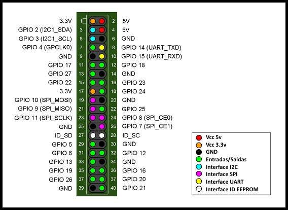

Figura 22: Pinos GPIO.

O circuito do LED é bastante simples (Figura 23).

Figura 23: Conexão de LED ao Rpi.

A indicação física de conexão do LED nos pinos GPIO é indicada na Figura 24:

Figura 24: Pinos GPIO.

Após a instalação da bibloteca _wiringpi_, são habilitadas as seguintes comandos do modo GPIO que podem ser digitados no terminal:

*   1.  Comandos de entrada e saída no LXTerminal

**gpio mode &lt;pin&gt; in / out / pwm / clock / up / down / tri**

Esse comado define o modo de um pino para ser de entrada, saída PWM ou clock, e, adicionalmente, pode definir os resistores internos de _pull-up_ e _pull-down_ ou nenhum.

| **gpio write &lt;pin&gt; 0/1** |
| --- |

Define um pino de saída para alto (1) ou baixo (0)

| **gpio pwm &lt;pin&gt; &lt;valor&gt;** |
| --- |

Define o pino para um valor PWM (de 0-1023)

| **gpio read &lt;pin&gt;** |
| --- |

Lê e imprime o valor lógico do pino de dado. Ele irá imprimir 0 (baixo) ou 1 (alto).

| **gpio readall** |
| --- |

Esse comando lê todos os pinos normalmente acessíveis e imprime uma tabela de seus números (wiringPi, BCM_GPIO e números de pinos físicos), por isso torna-se um gráfico de referência cruzada útil), juntamente com os seus modos e valores atuais.

| **gpio wfi &lt;pin&gt; subida / descida / ambos** |
| --- |

Isso faz com que GPIO para realizar uma espera não-ocupada em um único pino GPIO até que muda de estado para que indicado.

| **gpio edge &lt;pin&gt; rising/falling/both/none** |
| --- |

(subida / queda / ambos / nenhum)

Isso permite que o pino para borda interrupção seja habilitado na subida, descida ou ambas as bordas ou nenhum para desativá-lo.

Nota: **Os números de pinos no modo sys são sempre números de pinos BCM-GPIO.**

Exemplos: Os comandos abaixo utilizam os números de pinos wiringPi para definir pino 0 como uma saída e, em seguida, define o pino para nível lógico 1.

| **gpio mode 0 out** |
| --- |

Os comandos abaixo utilizam esquema de numeração pin BCM_GPIO e realiza a mesma operação como acima.

| **gpio -g mode 17 out** |
| --- |

Este outro abaixo utiliza o esquema de numeração física dos mesmos pinos dos comandos anteriores e executam a mesma operação como acima.

| **gpio -1 mode 11 out** |
| --- |

*   1.  Resistores internos de pull-up e pull-down

Os pinos GPIO têm resistências internas pull-up que podem ser controladas via software quando um pino está em modo de entrada.

| **gpio mode 0 up** |
| --- |

Neste exemplo, são definidos os resistores para _pull-up_, _pull-down_ e nenhum (_tristate_), respectivamente, em wiringPi no pino 0\. Em linguagem C, o comando WiringPi utilizado é o **pullUpDnControl(int pino, int PUD);** //PUD pode ser PUD_UP, PUD_DOWN ou PUD_OFF.

Um circuito tipíco de botão ligado a um pino do Rpi com pull-up é ilustrado nna Figura 25.

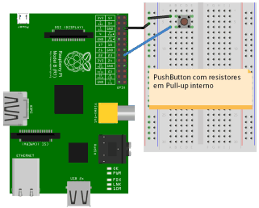

Figura 25: Conexão de botão ao Rpi.

Quando o botão for prossionado o nível logico do pino passa de 1 (alto) para o nível lógico baixo (0), pois o curto-circuito do botão conecta o pino ao Gnd.

*   1.  Comandos _shell_ para acionamento dos pinos

Para atuar os pinos físicos, o processador olha para os registros disponíveis em /sys/class/gpio. Então para modificar o estado físico dos pinos, é necessário inicialmente exportá-los para esse diretório /sys/class/gpio/export.

| **_echo 17 > /sys/class/gpio/export_** |
| --- |

Após a exportação, é possível verificar o surgimento do diretório /sys/class/gpio/gpio17 em /sys/class/gpio/. Em seguida, este pino BCM deve ser configurado para saída, ecoando **_out_** para _direction_:

| **_echo out > /sys/class/gpio/gpio17/direction_** |
| --- |

​E finalmente comandar o valor 1 ou 0 para ligar e desligar o pino BCM:

| **_echo 1 > /sys/class/gpio/gpio17/value_** |
| --- |

Dessa forma, é possível fazer um led piscar através de um script _shell_:

| _#!/bin/sh_ |
| --- |

Outro exemplo para comandos shell é descrito a seguir. Crie um diretório exemplo para inserir um script.

| **Illegal nested table :** 123cd ~mkdir scriptscd scripts |
| --- |

Crie o seguinte script com um arquivo chamado **lightswitch**

| 01 | #!/bin/bash |
| --- | --- |

Declare o script como executável:

|  | chmod +x lightswitch |
| --- | --- |

Execute o script com os comandos abaixo.

|  | ./lightswitch on |
| --- | --- |

Se tudo ocorrer corretamente, o pino gpio 4 vai varias com os comandos acima.

*   1.  Comandos WiringPi

| **gpio export &lt;pin&gt; in/out** |
| --- |

Exporta o comando WiringPi, realizado por software, para um pino físico (BCM-GPIO) configurado em /sys/class/GPIO e o define como uma entrada ou saída tornando o pino disponível para os usuários.

| **gpio unexport &lt;pin&gt;** |
| --- |

Remove a exportação de um pino.

| **gpio unexportall** |
| --- |

Remove todas as exportações /sys/class/GPIO.

| **exports GPIO** |
| --- |

Isso imprime uma lista de todos os pinos GPIO que foram exportados através da interface em /sys/class/GPIO e seus modos.

Levando em consideração que a biblioteca **_"wiringpi" _**já esteja instalada, vamos digitar o seguinte comando para ver a situação das portas GPIO do Raspberry disponível em /sys/class/GPIO. É necessário estar como usuário root (_sudo su_).

| **_gpio readall_** |
| --- |

Aparecerá a tabela da Figura 26.

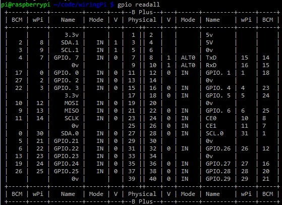

Figura 26: Wiring Pi.

Veja que a GPIO 17 (primeira linha da tabela) está em modo OUT, ou seja, é possível enviar comandos através dela. Caso a porta esteja em modo IN, deve-se mudar sua configuração para OUT, da seguinte forma:

| **_gpio mode 0 out_** |
| --- |

Veja que o valor dessa porta está como LOW. Para mudar o valor manualmente, podemos digitar o seguinte comando:

| **_gpio write [wiringpi port] [0/1]_**_ _,ou seja, |
| --- |

Nesse caso o valor dessa porta passará a ser HIGH. Mas o que queremos é mudar o valor (0/1) dessa porta através de um código C para piscar o LED. Para isso, você pode utilizar o diretório compartilhado /home/share para criar o arquivo blink.c. 

Para configuração do número dos pinos é possível utilizar os seguintes comandos em int main():

| **wiringPiSetup();** //Para configurar os pinos na sequência wPi |
| --- |

Segue abaixo o código em C (blink.c) para fazer o LED piscar a cada 0,5 segundo:

| _#include <stdio.h>_ |
| --- |

Para compilar o código, é necessário digitar a seguinte linha de comando:

| **_gcc -o blink blink.c –l wiringPi_** |
| --- |

Para executar, digite o comando:

| **_./blink_** |
| --- |

Modulação por largura de pulso PWM pela biblioteca Wiringpi

Escreve o valor para o registo PWM para o pino. O PWM definido pelo WiringPi utiliza um pino de PWM, o pino 1 (BMC_GPIO 18, físico 12) e o intervalo fixo do ciclo de trabalho é de 0 a 1024\. Outros dispositivos PWM podem ter outras faixas de PWM.

| _#include <wiringPi.h>_ |
| --- |

*   1.  Modulação por largura de pulso (PWM) por Hardware

Para configurar a frequência do sinal PWM **por hardware** é necessário utilizar as funções pwmSetClock() e pwmSetRange(). O intervalo válido para pwmSetClock() varia de 2 a 4095, enquanto o intervalo válido para pwmSetRange() é de até 4096\. Nesse caso, para configurar o PWM por hardware igual ao PWM wiringPi poderiam ser utilizados _pwmSetClock(2)_, _pwmSetRange(1024)_ e _pwmSetMode(PWM_MODE_MS)_.

O clock do PWM por Hardware do Raspberry Pi tem uma frequência base de 19,2 MHz. Essa frequência, divida pelo argumento de pwmSetClock(), é a frequência em que o contador PWM é incrementado. Quando o contador atinge um valor igual ao intervalo definido em pwmSetRange(), ele reinicia para zero. Por exemplo, se for usado o intervalo de 4, ou seja, pwmSetRange(4), você poderia alcançar altas frequências, mas estaria habilitado apenas a configurar o ciclo de trabalho para 0/4, 1/4, 2/4, 3/4 or 4/4\.

Enquanto o contador é menor do que o ciclo de trabalho especificado, a saída é alta, caso contrário, a saída é baixa. Para definir o PWM com uma frequência específica, é possível usar a seguinte relação:

Frequência PWM por passo in Hz = 19.2 MHz / pwmClock

Dessa forma, por exemplo, para pwmSetClock(192), a frequência total de PWM por passo será de 100 KHz (19.200 KHz/192), ou seja, o ciclo de trabalho pode ser incrementado a cada 10 us. Para pwmSetRange(100), O período total do ciclo de trabalho será de 1000 us (100x10us).

Os modelos A e B têm um PWM por hardware no pino BCM 18 (wPi 1 ou pino físico 12).

Modelos A+ e B+ têm uma segunda saída PWM por hardware nos pino BCM 18 (wPi 1 ou pino físico 12) e o pino BCM 13 (wPi 23 ou pino físico 33), testado no exemplo abaixo.

O gerador de PWM por hardware pode ser executado em dois modos - "balanced" e "mark:space", que é mais comum, no entanto, o modo padrão do Pi é "balanced". É possível alternar entre os modos, fornecendo o parâmetro:

| **PWM_MODE_BAL ou PWM_MODE_MS.-> pwmSetMode(PWM_MODE_MS);** |
| --- |

Exemplo:

| #include <wiringPi.h> //Vídeo: [https://www.youtube.com/watch?v=hvH2pO4IsH4](https://www.youtube.com/watch?v=hvH2pO4IsH4) |
| --- |

Comunicação serial entre um microcontrolador PIC e Raspberry Pi

Neste tópico, são descritas as duas formas de comunicação utilizadas neste trabalho, sendo elas a comunicação serial e a interface USB. Para realizar a comunicação serial entre um microcontrolador PIC e Raspberry Pi, é preciso utilizar os pinos Ground, o GPIO 14 (TX) e o GPIO 15 (RX), conforme Figura XX.

Neste projeto, o computador utilizado para realizar a gravação do microcontrolador da placa PIC SanUSB é o sistema embarcado Linux Raspberry Pi, cujos pinos de conexão para gravação via USB e comunicação serial são ilustrados na Figura 27\. Para a conexão serial, você vai usar o _Ground_, o _GPIO 14_ (TX) e o _GPIO 15_ (RX), conforme imagem abaixo:

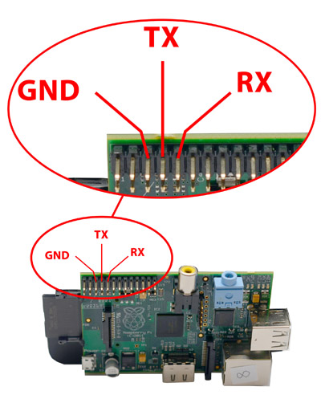

Figura 27:Pinos necessários para comunicação serial.

Na Figura 28 é mostrada a conexão com modem bluetooth para depuração e teste da comunicação serial através de um aplicativo Android serial como o BlueTerm. O pino Rx do Rpi tem tensão de 3,3V e como o Tx do modem bluetooth tem tensão de 5V, é recomendável colocar um resistor de 1 K entre o Rx do Rpi e o Tx do modem, pois como todos os pinos do Rpi têm um diodo grampeador interno para 3,3V, então caso haja diferença de tensão na comunicação, esta ficará aplicada sobre o resistor de 1K. Um exemplo de aplicação com bluetooth, Rpi e pic pode ser vista em [https://www.youtube.com/watch?v=jFxrw3wCvwI](https://www.youtube.com/watch?v=jFxrw3wCvwI) .

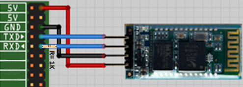

Figura 28: Conexão entre o modem bluetooth e o Raspberry Pi.

*   1.  Funções seriais WiringPi

Para usar, você precisa se certificar que seu programa inclui o seguinte arquivo:

| **#include <wiringSerial.h>** |
| --- |

Em seguida, as seguintes funções estão disponíveis:

| **int serialOpen (char *device, int baud);** |
| --- |

Isso abre e inicializa o dispositivo serial e define a taxa de transmissão. Ele define a porta, a taxa, e define o tempo limite de leitura para 10 segundos. O valor de retorno é o descritor de arquivo ou -1 por qualquer erro, caso em que errno será definido conforme o caso.

| **void serialClose (int fd);** |
| --- |

Fecha o dispositivo identificado pelo descritor de arquivo dado.

| **void  serialPutchar (int fd, unsigned char c) ;** |
| --- |

Envia o único byte para o dispositivo serial identificado pelo descritor de arquivo dado.

| **void  serialPuts (int fd, char *s);** |
| --- |

Envia a string terminada em nulo ao dispositivo serial identificado pelo descritor de arquivo dado.

| **void  serialPrintf (int fd, char *message, …);** |
| --- |

Emula a função printf sistema ao dispositivo serial.

| **int serialDataAvail (int fd);** |
| --- |

Retorna o número de caracteres disponíveis para leitura, ou -1 para qualquer condição de erro, caso em que errno será definido de forma adequada.

| **int serialGetchar (int fd);** |
| --- |

Retorna o próximo personagem disponível no dispositivo serial. Esta chamada vai bloquear por até 10 segundos, se não há dados disponíveis (quando ele retornará -1)

| **void serialFlush (int fd);** |
| --- |

Isso descarta todos os dados recebidos, ou esperando para ser enviados.

**Nota:** O descritor de arquivo (fd) retornado é um descritor de arquivo padrão do Linux. Você pode usar a leitura _standard ( ), write ( ),_ etc. sistema chama sobre este descritor de arquivo conforme necessário. Por exemplo você pode querer escrever um bloco maior de dados binários em que a função _serialPutchar ( ) ou serialPuts ( )_ pode não ser a função mais adequada para usar, caso em que, você pode usar _write ( )_ para enviar os dados.

*   1.  Configuração serial do Raspberry Pi

1\. Faça um backup do arquivo original /boot/cmdline.txt.

| **sudo cp /boot/cmdline.txt /boot/cmdline.out.txt** |
| --- |

2\. Edite arquivo /boot/cmdline.txt:

| **sudo nano /boot/cmdline.txt** |
| --- |

Este arquivo contém:

| **dwc_otg.lpm_enable=0** console=ttyAMA0,115200 **console=tty1 root=/dev/mmcblk0p2 rootfstype=ext4 elevator=deadline rootwait** |
| --- |

Remover os parâmetros que fazem referências a taxa de transmissão _default_ da porta serial UART de 115200 bps, como **console = ttyAMA0,115200** , ficando assim:

| **dwc_otg.lpm_enable=0 console=tty1 root=/dev/mmcblk0p2 rootfstype=ext4 elevator=deadline rootwait** |
| --- |

3\. Comente a próxima linha em **/etc/inittab**, adicionando # na frente dele:

| **# T0: 23: de respawn: / sbin / getty -L ttyAMA0 115200 vt100** |
| --- |

Agora, Instale o terminal serial minicom para configurar e testar a taxa de comunicação serial:

| **sudo apt-get install minicom** |
| --- |

4\. Reinicie o Raspberry Pi para carregar a nova configuração

| **sudo reboot** |
| --- |

*   1.  Configurando manualmente a porta serial com minicom

Para configurar o terminal serial minicom (apt-get install minicom) com outra taxa de transmissão, abra o minicom no terminal (Figura 28) com o seguinte comando:

| **sudo minicom -s** |
| --- |

Selecione a opção **“Serial Port Setup”**(Figura 28):

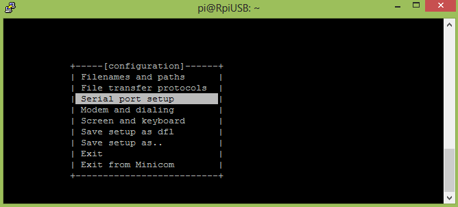

Figura 29: Serial Port Setup.

Pressione o botão **"A"** para mudar o dispositivo para **"ttyAMA0"** &lt;Enter&gt;,e **"E"** &lt;Enter&gt; para modificar a taxa (_baud rate_) para, por exemplo, 19200 como ilustrado n Figura 29.

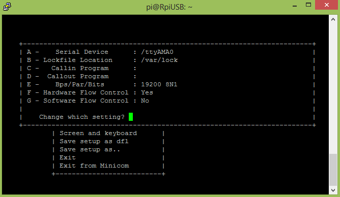

Figura 30: Configurações no LXTerminal.

Selecione  **Save setup as dfl** para alterar permanentemente a taxa de transmissão e depois pressione **Enter** para voltar ao menu principal (Figura 30). Selecione **Exit** para sair do minicom com a nova configuração. Pronto, a interface serial está configurada com a nova taxa de transmissão podendo a partir de agora utilizar os comando wiringPi da biblioteca **wiringSerial.h.**

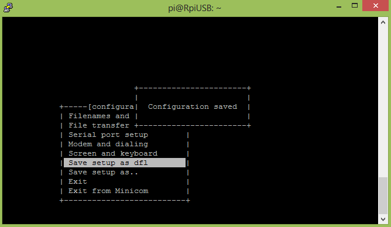

Figura 31: Configurações no LXTerminal.

Para testar a conexão de um dispositivo como um microcontrolador ou um modem bluetooth via porta serial com o terminal do Rpi, abra um terminal serial em um dispositivo Android e execute a linha de comando abaixo no terminal do Rpi.

| **minicom -b 19200 -o -D /dev/ttyAMA0** |
| --- |

Minicom rodando em 19200 bps (Figura 31).

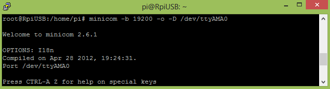

Figura 32: Configurações no LXTerminal.

Quando for digitado um caractere no terminal minicom, ele vai ser recebido pelo dispositivo ou terminal serial Android, que por sua vez, ao enviar um caractere ASCII será recebido pela serial do Rpi e mostrado no minicom. Para sair, pressione “Ctrl+A” liberação em seguida, tecle X. Surgirá a tela da Figura 32 e pressione “Yes”.

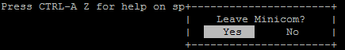

Figura : Saindo do minicom.

O vídeo em [https://www.youtube.com/watch?v=rfffzww1k6g](https://www.youtube.com/watch?v=rfffzww1k6g) demonstra um exemplo de comunicação serial entre o Pic e o Rpi, como ilustra a Figura 33.

Mais detalhes em: sanusb.org/tools/serialconfigtest.zip.

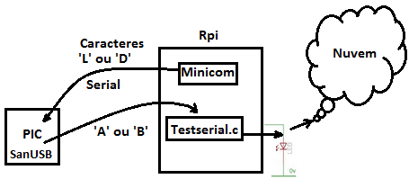

Figura : Ilustração da comunicação serial entre Pic e Rpi

O Minicom é utilizado, como teste em um terminal do Rpi, para enviar comandos via serial para o PIC (‘L’ ou ‘D’), que por sua vez, retorna via serial outros caracteres (‘A’ ou ‘B’) para o Rpi que também está executando um firmware (Testserial.c). Este firmware recebe os comandos do PIC para acender ou apagar um Led (wPi 1) e postar o estado do Led na nuvem. O código Testeserial.c é mostrado abaixo:

| #include <stdio.h> |
| --- |

Firmware do PIC abaixo:

| #include "SanUSB48.h" //https://www.youtube.com/watch?v=-9Gf5K0SZ2Y |
| --- |

Agora veja um exemplo de como concatenar os bytes em forma de string do PIC pro Raspberry. Além disso, observe posteriormente como é feito passo a passo para enviar dados via WiFi do microcontrolador para a Google.

Firmware do Raspberry abaixo:

| #include <stdio.h> |
| --- |

Firmware PIC abaixo:

| ////Resistor de 1K entre os pinos C1 (PWM) e A0(analógico) e um capacitor de 10uF |
| --- |

Perceba que o PIC ficará enviando os dados do potenciômetro(primeiramente o dado é convertido de analógico para digital) para o Raspberry, logos após isso, o Raspberry tratará de enviar essa palavra para o servidor do Google.

Veja agora como é feito o passo a passo para enviar dados via WiFi do microcontrolador para a Google :

1° – Inicialmente é necessário criar um formulário de página do _Google Drive_ (você deve estar conectado) que armazena os dados inseridos em uma planilha gerada automaticamente.

2 ° - Selecione "Criar " -> "Form" do Google Drive menu.

Feche se aparecer _lay-out_ personalizado.

**3° - Criar o formulário com caixa tipo TEXTO**. Insira quantos Itens seja necessário, clicando em **adicionar item**. Dê um nome ao formulário e às perguntas (**os títulos das perguntas serão os nomes das colunas da tabela de sensoriamento**):

4° – Na Página de confirmação clique em **Enviar Formulário** e depois Clique em "**Concluído**".

Clicando em **Ver respostas**, na linha indicada pela seta da figura abaixo, aparece a planilha gerada automaticamente e vinculada para armazenar os dados [https://docs.google.com/spreadsheets/d/1rtEU-N_Rjt0_B7Z7QQWpyOUGVXVoIP5BM6b8vMMygR8/edit#gid=240549087](https://docs.google.com/spreadsheets/d/1rtEU-N_Rjt0_B7Z7QQWpyOUGVXVoIP5BM6b8vMMygR8/edit) e clicando em **Ver formulário publicado** aparece o formulário com o endereço chave em vermelho [**https://docs.google.com/forms/d/1yC9zbTd7K4ZDxkJS3oEmbPCbBZfFRC0tqqSJB1gQ6sU/**viewform](https://docs.google.com/forms/d/1yC9zbTd7K4ZDxkJS3oEmbPCbBZfFRC0tqqSJB1gQ6sU/viewform)

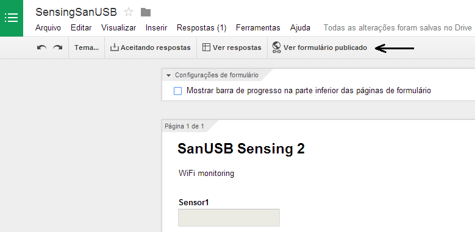

Dessa forma, o endereço do formulário criado é [https://docs.google.com/forms/d/1yC9zbTd7K4ZDxkJS3oEmbPCbBZfFRC0tqqSJB1gQ6sU](https://docs.google.com/forms/d/1yC9zbTd7K4ZDxkJS3oEmbPCbBZfFRC0tqqSJB1gQ6sU) .

5° – Cada entrada de sensor recebe um nome (_name_), por exemplo, **entry.955491578**, **entry.1225247694**, etc. que pode ser visto explorando o código HTML, clicando com o botão direito dentro da caixa de texto e em inspecionar elemento e levante a aba para ver o script.

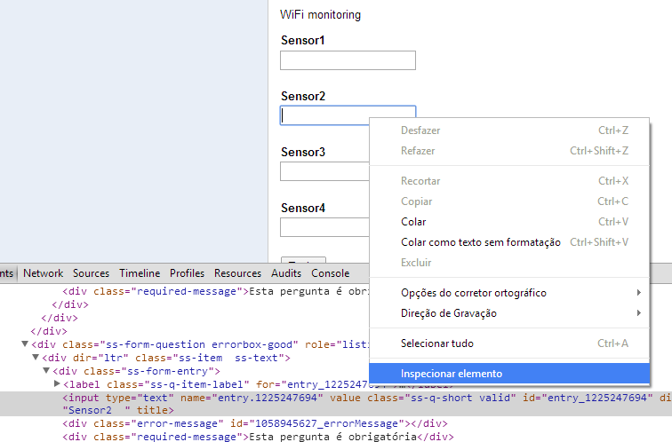

6°- Dessa forma, os nomes das entradas são **entry.955491578** de Sensor1, **entry.1225247694** de Sensor2, **entry.1109841047** de Sensor3 e **entry.2058980495** de Sensor4\. Para enviar dados para o formulário, é necessário utilizar esta sintaxe:

**https://docs.google.com/forms/d/Endereçodoformulario**/formResponse?&ifq&**entrada do sensor** =**Valor** &submit=Submit

Exemplo:

[**https://docs.google.com/forms/d/**1yC9zbTd7K4ZDxkJS3oEmbPCbBZfFRC0tqqSJB1gQ6sU/formResponse?ifq&**entry.955491578**=7&**entry.1225247694**=30&**entry.1109841047**=27&**entry.2058980495**=5000&submit=Submit](https://docs.google.com/forms/d/1yC9zbTd7K4ZDxkJS3oEmbPCbBZfFRC0tqqSJB1gQ6sU/formResponse?ifq&entry.955491578=7&entry.1225247694=30&entry.1109841047=27&entry.2058980495=5000&submit=Submit)

8° – Os dados são copiados na planilha da Google criada automaticamente anteriormente [https://docs.google.com/spreadsheets/d/1rtEU-N_Rjt0_B7Z7QQWpyOUGVXVoIP5BM6b8vMMygR8/edit#gid=240549087](https://docs.google.com/spreadsheets/d/1rtEU-N_Rjt0_B7Z7QQWpyOUGVXVoIP5BM6b8vMMygR8/edit):

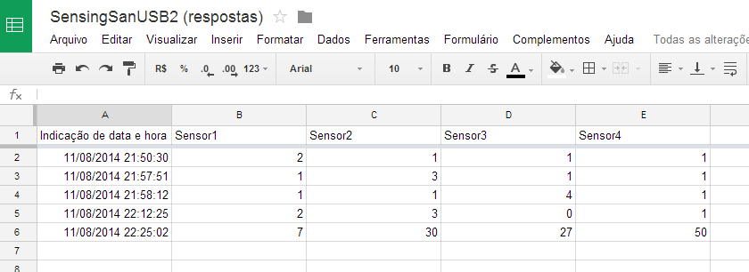

9° – É utilizado o método POST para enviar dados para o formulário. Este código armazena no banco de dados da Google, em forma de planilha, o valor da entrada de quatros sensores.

*   1.  RTOS em um PIC de 8 bits com conversor A/D e comunicação serial

Os RTOS são sistemas operacionais de tempo real que executam tarefas de forma concorrente por meio de interrupções de temporizadores. A utilização de um RTOS se justifica pela facilidade de programação. Veremos que, mesmo com toda sua simplicidade, um microcontrolador de 8 bits possui desempenho satisfatório quando atua em conjunto com o RTOS. O RTOS possui a importante característica de processar tarefas de forma concorrente. A possibilidade de descrever cada tarefa em uma função task torna a programação de projetos muito mais simples, pois o próprio sistema operacional se encarrega de gerenciá-las. É essa característica que torna o RTOS um sistema operacional baseado em multitarefas.

A principal diferença entre os sistemas operacionais multitarefa de propósito gerais (GPOS) e os RTOS é a necessidade de o segundo apresentar um comportamento temporal previsível: a execução de tarefas no RTOS acontece em frações de tempo conhecidas e esperadas. Os RTOS operam em sistemas que devem fornecer serviços em prazos restritos e que possuem capacidades de memória e de processamento limitadas.

Seu kernel fornece uma camada de abstração que objetiva esconder do usuário detalhes do hardware do processador sob o qual o seu software será executado.

O software do usuário é dividido em tasks que, por sua vez, possuem restrições temporais e uma relação de comunicação e sincronização com as demais.

A partir da camada de abstração, o kernel do RTOS oferece cinco principais categorias de serviços básicos para o software do usuário:

1.  Gestão de Tarefas: principal categoria. O conjunto de serviços oferecidos pelo RTOS permite que um aplicativo possa ser implementado, testado e mantido através da divisão do problema em tarefas menores e de compreensão mais fácil. Essa abordagem modular permite que tasks individuais sejam utilizados em outros projetos. Nesta categoria, o principal serviço é o escalonador de tarefas, serviço que controla a execução das tarefas da aplicação.
2.  Comunicação e sincronização entre tarefas: nesta categoria, os serviços permitem que as tasks troquem informações sem o risco de serem corrompidas.
3.  Temporizadores: em função dos prazos que devem ser cumpridos pelas tarefas nos sistemas embarcados, os RTOS dispõem de serviços básicos de temporização, como serviços de atraso e de limite de tempo.
4.  Alocação dinâmica de memória: esta categoria de serviços permite que processos aloquem memória RAM temporariamente.
5.  Supervisão de I/O: estes serviços fornecem uma organização e acesso uniforme de muitos dispositivos de hardware típicos dos sistemas embarcados.

#### Prática {#pr-tica}

Foi implementado em um RTOS três tarefas em um PIC de oito bits através do compilador MPLABX C18\. O firmware, por ser descrito em tarefas concorrentes, faz uso dos temporizadores do PIC gerando interrupções previsíveis. Esse aspecto traz a ilusão de uma execução paralela e independente de tarefas. Na primeira tarefa é utilizado o conversor A/D com um potenciômetro, onde de acordo com o valor de entrada o PIC irá ativar as porta B6 e B5 para acender leds de acordo com a tabela abaixo. Pela comunicação serial é possível decidir a velocidade em que os leds irão piscar através de ‘char’ enviado, situação definida na segunda tarefa. E a terceira faz o led do pino B7 piscar.

| **ENTRADA POTENCIOMETRO** | **LEDS PISCANDO** |
| --- | --- |
| **0 – 300** | **Led do pino B5** |
| **301 – 800** | **Led do pino B6** |
| **> 801** | **Leds do pino B5 e B6** |

Figura : Prática em funcionamento, recebendo comandos bluetooth e enviando valores do potenciometro para a serial..

O vídeo em [https://www.youtube.com/watch?v=c2WLafjximM&feature=youtube](https://www.youtube.com/watch?v=c2WLafjximM&feature=youtube) mostra o funcionamento do sistema implementado.

O código rtos_AD_Serial.c é mostrado abaixo:

| #include "SanUSB48.h" |
| --- |

Gravando o PIC via USB utilizando RPi

Para instalação dos programas necessários para a gravação via USB, baixe o arquivo disponível em [https://www.dropbox.com/s/whwolbzf0cwkkb9/SanUSBrpi.zip?dl=0](https://www.dropbox.com/s/whwolbzf0cwkkb9/SanUSBrpi.zip?dl=0) e extraia para a pasta compartilhada /home/share (se não houver a pasta, basta criar com mkdir /home/share). Depois instale o pacote sanusb_raspberry.deb seguindo o tutorial em [https://www.youtube.com/watch?v=S30wVi9RWEs](https://www.youtube.com/watch?v=S30wVi9RWEs). A pasta SanUSBrpi já contém o binário executável válido sanusb para a gravação do microcontrolador via USB com Raspberry Pi utilizando linhas de comando no LXTerminal.

Para instalar pelo LXTerminal, utilizando putty ou tightVNC, basta digitar:

| 

*   wget [sanusb.org/prog/SanUSBrpi.zip](https://www.dropbox.com/s/whwolbzf0cwkkb9/SanUSBrpi.zip)
*   unzip SanUSBrpi.zip
*   cd SanUSBrpi
*   sudo dpkg -i sanusb_raspberry.deb
*   cp sanusb /usr/share/sanusb

 |
| --- |

Ou executar diretamentamente o script (./SanUSBrpi.sh), dentro da pasta SanUSBrpi.zip, com permissão anterior de execução (chmod +x SanUSBrpi.sh).

Para testar se a instalação ocorreu corretamente, verifique o comando de help (./sanusb -h) no LXTerminal:

| 

*   /usr/share/sanusb/./sanusb –h

 |
| --- |

**Resposta:**

pi@raspberrypi /usr/share/sanusb/./sanusb –h

sanusb : Free PIC USB Programmer ([www.tinyurl.com/SanUSB](http://www.tinyurl.com/SanUSB))

| **z** | **Description** | **Default** |
| --- | --- | --- |
| -w &lt;file&gt; | Write hex file to device (will erase first) | None |
| -e | Erase device code space (implicit if -w) | No erase |
| -r | Reset device on program exit | No reset |
| -h | Help |  |

Antes de iniciar a gravação, verifique se o _jumper_ de tensão da porta USB (+5V) está removido, pois a alimentação do microcontrolador vem do pino do 3,3V do Rpi, como o circuito abaixo, para que os dois possam se comunicar na mesma tensão (3,3V) e não ocorrer danos nos pinos por sobretensão em (5V), veja Figura 34.

Figura 36: Conexão entre Rpi e PIC.

Com o pino físico 11 do Rpi, ou seja, wPi 0 ligado por um fio no pino 1 (pin_e3) do microcontrolador, execute o código **WiringPiGCCParaGravarPICviaUSB** para gravar e regravar o microcontrolador, como descrito abaixo:

| pi@raspberrypi ~ $ _sudo su_ |
| --- |

Em substituição ao código _WiringPiGCCParaGravarPICviaUSB_ para regravação do microcontrolador, é possível digitar diretamente no LXTerminal:

| **gpio mode 0 out** &lt;Enter&gt; (configura o pino wPi 0 como saída), depois: |
| --- |

e finalmente:

| **gpio write 0 1** &lt;Enter&gt; (escreve 1 no pino wPi 0 conectado ao pin_e3 do PIC para operação do microcontrolador após a gravação). |
| --- |

| root@raspberrypi:/home/share/SanUSBrpi/CodigoWiringPiParaGravarPICviaUSB# **gpio mode 0 out** |
| --- |

Para gravação via USB, basta conectar o cabo USB (5V) e ligar apenas o fio azul entre o pino físico Rpi 11 (Wpi 0) de 3,3 V ao pino e3 do microcontrolador PIC (pino 1 de entrada). Essa conexão, com proteção de tensão (5V <-> 3,3 V), é possível porque os pinos de I/O do Rpi têm um diodo grampeador interno para 3,3V.

Além disso, o pino e3 da placa PIC SanUSB tem um resistor de 2k2 ligado à fonte USB (5V), o que permite a aplicação da tensão de 3,3 V em um lado do resistor

conectado ao pino e3 de entrada do PIC, com tensão proveniente do pino Wpi 0 do Rpi através do fio azul, e permite também a tensão de 5V (fonte USB da placa PIC) do outro lado deste resistor de 2k2\. Dessa forma, é aplicado a queda de tensão (5V - 3,3 V) no resistor protegendo o pino Rpi 11 (Wpi 0), quando o pino e3 de entrada do PIC recebe nível lógico alto.

Caso seja utilizada comunicação serial, é necessário verificar se o jumper de tensão da fonte USB (+5V) do PIC está removido, pois a alimentação do microcontrolador deve vir do pino de 3,3V do Raspberry pi (Rpi), como o circuito abaixo, para que os dois possam se comunicar na mesma tensão (3,3V) e não ocorrer danos nos pinos do Rpi de 3,3V por sobretensão (5V).

Mais detalhes em [http://sanusb.blogspot.com.br/2015/02/gravando-pic-online-via-porta-usb-de-um.html](http://sanusb.blogspot.com.br/2015/02/gravando-pic-online-via-porta-usb-de-um.html)

A placa PIC SanUSB pode ser construída seguindo o tutorial e os programas disponíveis em https://dl.dropbox.com/u/101922388/121007SanUSBOrig.zip ou adquirida em [http://lista.mercadolivre.com.br/sanusb](http://lista.mercadolivre.com.br/sanusb) .

Tutorial de Instalação da gravação de firmware em nuvem

Após inserir um nome de um perfil no site [http://sanusb.org/rs/sanusb.php](http://sanusb.org/rs/sanusb.php) e realizar o _upload_ de um arquivo a ser compilado e executado no RPI, como os arquivos exemplos da pasta [http://sanusb.org/rs/examples.zip](http://sanusb.org/rs/examples.zip) , é necessário baixar o SloaderInstall.sh, ou seja, o arquivo SloaderInstall.sh será gerado pelo servidor em [http://sanusb.org/rs/sanusb.php](http://sanusb.org/rs/sanusb.php)após inserir o nome do seu perfil em _Insert the plattform name_ e clicar em Enviar, onde surgirá o link para _download_ [wget sanusb.org/rs/**SEU_PERFIL**/SloaderInstall.sh](http://sanusb.org/rs/tests/SloaderInstall.sh) .

Configure o crontab para que o _shell script_ SloaderInstall.sh baixado seja executado na inicialização do sistema. Para isso, siga os passos abaixo:

1.  Abra o terminal do _Raspberry Pi_ e entre como super-usuário sudo.
2.  Para que os comandos que foram copiados para a página do _crontab_ funcionem, é necessário que o shell script nomeado de **SloaderInstall.sh** esteja dentro do diretório **CronSloader**. Se o diretório não existir, crie-o dentro da pasta share, para isso basta digitar no terminal o comando **mkdir /home/share/CronSloader**.
3.  Digite o comando **crontab –e**
4.  Umas página de edição será aberta, dessa o cursor até o final da página (todas as linhas que começam com **#** são apenas comentários)
5.  Copie o texto (comandos) abaixo e cole na página do crontab:

* * * * * sh /home/share/CronSloader/SloaderInstall.sh

* * * * * sleep 5; sh /home/share/CronSloader/SloaderInstall.sh

* * * * * sleep 10; sh /home/share/CronSloader/SloaderInstall.sh

* * * * * sleep 15; sh /home/share/CronSloader/SloaderInstall.sh

* * * * * sleep 20; sh /home/share/CronSloader/SloaderInstall.sh

* * * * * sleep 25; sh /home/share/CronSloader/SloaderInstall.sh

* * * * * sleep 30; sh /home/share/CronSloader/SloaderInstall.sh

* * * * * sleep 35; sh /home/share/CronSloader/SloaderInstall.sh

* * * * * sleep 40; sh /home/share/CronSloader/SloaderInstall.sh

* * * * * sleep 45; sh /home/share/CronSloader/SloaderInstall.sh

* * * * * sleep 50; sh /home/share/CronSloader/SloaderInstall.sh

* * * * * sleep 55; sh /home/share/CronSloader/SloaderInstall.sh

1.  Agora dê **Ctrl + x** para sair da página de texto, e depois aperte **Y** para salvar as mudanças.
2.  Depois execute um _reboot_ no RPI para que o cron realize automaticamente as chamadas do script SloaderInstall.sh a cada cinco segundos.

Interrupções com wiringPi

Com um kernel mais recente de manipulação de interrupção com o GPIO, é possível realizar por uma interrupção pelo wiringpi. Isso libera o processador para fazer outras tarefas enquanto não há uma interrupção. Os GPIOs pode ser configurado para interromper em uma subida, descida ou ambas as bordas do sinal de entrada.

**int waitForInterrupt (int pino, int timeOut);**

Quando chamado, ele vai esperar por um evento de interrupção para acontecer nesse pino e seu programa será parado. O parâmetro de tempo limite é dado em milissegundos, ou pode ser -1, o que significa que esperar para sempre.

| Ex.: if (waitForInterrupt (BUTTON_PIN, -1) > 0) // aguarde até interromper dentro |
| --- |

O valor de retorno é -1 se ocorreu um erro (e errno será definido apropriadamente), 0 se esgotou, ou 1 em um evento de interrupção bem-sucedido.

Antes de chamar waitForInterrupt, primeiro você deve inicializar o pino GPIO e, atualmente, a única maneira de fazer isso é usar o programa GPIO, seja em um script, ou usando o system de dentro do firmware.

| Ex.: system ("gpio edge 17 falling") ; // interrupcao por borda de descida |
| --- |

Outro exemplo. Para uma interrupção de queda de no pino 0, precisamos executar:

| system ("gpio edge 0 falling") ; |
| --- |

| **int wiringPiISR (int pin, int edgeType,  void (*function)(void)) ;** |
| --- |

Esta função registra uma função de interrupções recebidas no pino especificado. O parâmetro é edgeType ou INT_EDGE_FALLING, INT_EDGE_RISING, INT_EDGE_BOTH ou INT_EDGE_SETUP. Se for INT_EDGE_SETUP então não inicialização do pin vai acontecer - é assumido que você já tenha configurado o pino em outros lugares (por exemplo, com o programa de GPIO), mas se você especificar um dos outros tipos, então o pino será exportado e inicializado como especificado. Isto é conseguido através de uma chamada adequada para o programa utilitário GPIO, por isso, precisam estar disponíveis.

O número PIN é fornecido no modo atual - modos wiringPi, BCM_GPIO ou Sys nativas.

Esta função irá trabalhar em qualquer modo, e não precisa de privilégios.

A função será chamada quando a interrupção é disparada. Quando ele é acionado, é desmarcada na despachante antes de chamar sua função, por isso, se um disparo subsequente de interrupção antes de terminar o seu manipulador, então não vai ser desperdiçada. (No entanto, só pode acompanhar mais uma interrupção, se mais de uma interrupção de incêndios, enquanto um está sendo tratado em seguida, eles serão ignorados)

Esta função é executada em uma prioridade alta (se o programa é executado usando sudo, ou como root) e executa simultaneamente com o programa principal. Ele tem acesso total a todas as variáveis ​​globais, arquivos abertos e assim por diante.

Veja o exemplo de programa wiringPi **isr.c** para obter mais detalhes sobre como utilizar este recurso.

Interrupções e Tarefas concorrentes com wiringPi

*   1.  PI_THREADS NO LINUX

As bibliotecas de thread POSIX são APIs baseadas em padrões para C/C++. Estas permitem gerar um novo fluxo de processo concomitante. É mais eficaz em sistemas multiprocessador ou multi-core, onde o fluxo do processo pode ser programado para serem executadas em outro processador ganhando assim velocidade através de processamento paralelo real.

[http://www.yolinux.com/TUTORIALS/LinuxTutorialPosixThreads.html#CREATIONTERMINATION](http://www.yolinux.com/TUTORIALS/LinuxTutorialPosixThreads.html)

[http://timmurphy.org/2010/05/04/pthreads-in-c-a-minimal-working-example/](http://timmurphy.org/2010/05/04/pthreads-in-c-a-minimal-working-example/)

Pthreads são uma maneira simples e eficaz de criar uma aplicação multi-threaded. Esta introdução aos pthreads mostra a funcionalidade básica de executar duas tarefas em paralelo e fusão de volta para um único segmento em que o trabalho foi feito.

Aplicações multi-thread permitem que duas ou mais tarefas a serem executadas simultaneamente (ou seja: ao mesmo tempo). Quando uma thread é criada usando **piThreadCreate**, tanto a thread original quanto a nova thread compartilham a mesma memória; é como fazer duas chamadas de função, ao mesmo tempo. 

*   *   1.  Processamento simultâneo (multi-threading)

O wiringPi tem uma interface simplificada para a implementação Linux de threads POSIX, bem como um mecanismo (simplificado) para acessar (exclusões Mútuas) do mutex.

Usando essas funções você pode criar um novo processo (uma função dentro de seu programa principal), que decorre em simultâneo com o seu programa principal e utilizando os mecanismos mutex, passar com segurança variáveis ​​entre eles.

| **int piThreadCreate (name);** |
| --- |

Esta função cria um segmento que é uma outra função em seu programa previamente declaradas usando a declaração PI_THREAD. Esta função é então executado simultaneamente com o programa principal. Um exemplo pode ser a de ter essa função de espera para uma interrupção enquanto o programa carrega em fazer outras tarefas. A linha pode indicar um evento, ou ação por uso de variáveis ​​globais para nos comunicarmos com o programa principal, ou de outros tópicos.

Funções de Tópicos são declaradas como segue:

| **PI_THREAD (myThread)** |
| --- |

Abaixo está um firmware que alterna três leds em modo independente e concorrente através de três threads criadas.

| #include <stdio.h> |
| --- |

Considerndo a aplicação de tarefas concorrentes em um microcontrolador PIC USB, através de um RTOS (sistema operacional em tempo real), o firmware abaixo também pode ser utilizado para processar três tarefas.

| #include "SanUSB48.h" //Exemplo com 4 tarefas (task) concorrentes (paralelas) |
| --- |

| **piLock (int keyNum); e piUnlock (int keyNum);** |
| --- |

Estes sistemas permitem sincronizar atualizações variáveis ​​de seu programa principal para quaisquer threads em execução em seu programa. keyNum é um número de 0 a 3 e representa uma "chave". Quando um outro processo tenta bloquear a mesma chave, será parado até que o primeiro processo tenha desbloqueado a mesma chave.

Você pode precisar usar essas funções para garantir que você obtenha dados válidos quando a troca de dados entre o seu programa principal e um fio - caso contrário, é possível que o segmento poderia acordá-up até meio durante a copiar seus dados e alterar os dados - para que os dados que acabam -se a cópia é incompleta, ou inválido. Veja o programa wfi.c no diretório de exemplos para um exemplo.

*   1.  Funções Auxiliares

| **piBoardRev (void);** |
| --- |

Isso retorna a revisão da placa do Raspberry Pi. Vai ser 1 ou 2\. Alguns dos pinos BCM_GPIO mudaram número e função quando se deslocam de bordo revisão 1-2, por isso, se você estiver usando números de pinos BCM_GPIO, então você precisa estar ciente das diferenças.

| **wpiPinToGpio (int wPiPin);** |
| --- |

Isso retorna o número de pinos BCM_GPIO do pino wiringPi fornecido. Leva a revisão da placa em conta.

| **setPadDrive (grupo int, int valor);** |
| --- |

Isso define, ou seja, "força" a criação de drivers para um determinado grupo de pinos. Existem 3 grupos de pinos e a unidade é de 0 a 7\.

[http://ubidots.com/docs/get_started/quickstart/tutorial-collections.html](http://ubidots.com/docs/get_started/quickstart/tutorial-collections.html)

[http://blog.ubidots.com/building-a-people-counter-with-raspberry-pi-and-ubidots](http://blog.ubidots.com/building-a-people-counter-with-raspberry-pi-and-ubidots)

Biblioteca CURL

O curl é uma biblioteca que permite fazer requisições e enviar dados em shell para outros sites e serviços da web. Para instalar basta digitar **sudo apt-get install curl**

*   1.  Exemplos: Acessar um siste para post no LXTerminal

curl "https://docs.google.com/forms/d/1PZOqjnitER0m03Ix4r9gDBqhp7Xs1YrPmjLymE2VWAU/formResponse?ifq&entry.962023089=195&entry.1468266733=29&entry.1609904957=39&entry.1589284333=491&submit=Submit"

Ver resultados em:

https://docs.google.com/spreadsheets/d/1tDX1NalMiKmKVawsHfS7hpAf7lB5ZeHpYu0nLmau-TE/edit#gid=1687639411

Abaixo um código e C para armazenar valores em uma planilha do _google drive_.

| #include <stdio.h> |
| --- |

**Fazer o download de arquivo em um diretório desejado**

| **curl -L --output /home/share/$answer$content.hex http://sanusb.org/rs/$answer/$answer$content.hex** |
| --- |

**Fazer o upload de arquivo em um servidor online**

| **curl -F "password=sanusb" -F "arquivo=@/home/share/blink.c" http://sanusb.org/rs/upload.php** |
| --- |

**-F** preenche em sequência os dados do formulário upload.php do servidor.

**Capturar o conteúdo de um arquivo online em uma variável:**

| **content=$(curl -sl sanusb.org/rs/$answer/view.txt)** |
| --- |

Referências

Broadcom (2015) “BCM2835 ARM Peripherals” [https://www.raspberrypi.org/ documentation/hardware/raspberrypi/bcm2835/BCM2835-ARM-Peripherals.pdf](https://www.raspberrypi.org/%20documentation/hardware/raspberrypi/bcm2835/BCM2835-ARM-Peripherals.pdf), Abril.

Gordon Projects (2013) “WiringPi” [https://projects.drogon.net/raspberry-pi/wiringpi/](https://projects.drogon.net/raspberry-pi/wiringpi/), Maio.

Grupo SanUSB (2015) “Ferramenta SanUSB” [http://tinyurl.com/SanuSB](http://tinyurl.com/SanuSB), Abril.

Jucá, S. C. S., Carvalho, P. C. M. and Brito, F. T. (2009) “SanUSB: software educacional para o ensino da tecnologia de microcontroladores”, Ciências & Cognição, Rio de Janeiro, v. 14, p. 134-144.

Raspberry (2015) [http://www.raspberrypi.org/](http://www.raspberrypi.org/), Abril.

Sampaio, F., Jucá, S. C. S., and Pereira, R. I. S. (2014) “Aplicação WEB para Monitoramento Online de Microgeração Elétrica via Modem WiFi utilizando Fontes Renováveis de Energia”, V EATI – Encontro Anual de Tecnologia da Informação.

SanUSB (2015) “Gravando PIC online via porta USB de um Raspberry Pi” [https://www.youtube.com/watch?v=S30wVi9RWEs](https://www.youtube.com/watch?v=S30wVi9RWEs), Abril.

****Viva o Linux (2010)** **“Gravando PIC online via porta USB de um Raspberry Pi” [****http://www.vivaolinux.com.br/artigo/Gravacao-de-microcontroladores-PIC-via-USB-pelo-terminal-do-Linux?pagina=3****](http://www.vivaolinux.com.br/artigo/Gravacao-de-microcontroladores-PIC-via-USB-pelo-terminal-do-Linux?pagina=3)****, Agosto.****

Apêndices

*   1.  **EXECUTANDO SCRIPTS NA INICIALIZAÇÃO DO DEBIAN/UBUNTU**

[http://rberaldo.com.br/executando-scripts-na-inicializacao-do-debianubuntu/](http://rberaldo.com.br/executando-scripts-na-inicializacao-do-debianubuntu/)

[http://0jln.wordpress.com/2013/05/21/executando-scripts-na-inicializacao-raspberry-pi/](http://0jln.wordpress.com/2013/05/21/executando-scripts-na-inicializacao-raspberry-pi/)

Primeiramente, vamos criar um script chamado **meuScript** em /etc/init.d com uma estrutura semelhante à abaixo:

| _#!/bin/bash_ |
| --- |

Dê permissão de execução para o script:

| # **chmod** +x meuScript |
| --- |

A partir desse momento você já pode executar os comandos abaixo:

| _# /etc/init.d/meuScript start_ |
| --- |

Para inserir o script na inicialização do sistema, usamos o comando update-rc.d da seguinte maneira:

| # update-rc.d meuScript defaults |
| --- |

O “meuScript” é o nome do script em /etc/init.d, não o caminho completo a ele, ou seja, não importa em qual diretório você está, apenas coloque o nome do script.

O “defaults” indica que desejamos inserir o script nos _runlevels_ padrões do sistema.

Ao executar esse comando, um warning será mostrado, apesar de o comando ter funcionado. Aparecerá uma mensagem como esta:

| “**update-rc.d: warning: /etc/init.d/meuScript missing LSB informationupdate-rc.d: see <http://wiki.debian.org/LSBInitScripts>**” |
| --- |

Você pode ignorá-lo ou inserir as informações de LSB, o que é mostrado no link exibido no warning. É algo bem simples.

Para remover um script da inicialização:

| # update-rc.d -f meuScript remove |
| --- |

Como prometi, vou mostrar um exemplo que uso para uma instalação manual do Apache:

| _#!/bin/bash_ |
| --- |

*   1.  Tunelamento SSH

Tunelamento é o princípio para encapsular o protocolo de rede para um outro protocolo como por exemplo SSH (_Secure Shell_). Dessa forma, toda a comunicação de rede são criptografados. É também chamado de Port Forwarding. porque no tunelamento SSH é vinculada uma porta local. Assim que são os pacotes que vamos enviar essa porta particular, todos os pacotes são transparentemente criptografados e enviados ao sistema remoto.

SSH permite administrar um sistema remoto, porém não é suficiente para acessar todos os serviços que estão disponíveis no sistema remoto. O seguinte cenário da Figura 35 é mostrado como exemplo.

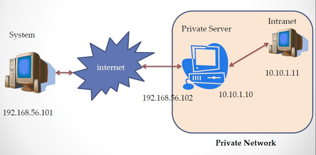

Figura 37: Tunelamento SSH.

Agora, vamos considerar o cenário, onde a máquina com IP 192.168.56.101 é o meu sistema que está ligado ao servidor de internet e um chamado dor privado (Private Server) com IP 192.168.56.102\. Este servidor tem duas interfaces Ethernet, uma está conectado à Internet e outro está ligado à rede local 10.10.1.0\. A máquina Intranet 10.10.1.11 é parte da sub-rede de 10.10.1.0.

No exemplo, foram mencionados, para o meu sistema, o IP 192.168.56.101 e para o sistema remoto 192.168.56.102, porém na realidade os IPs de Internet podem ser quaisquer endereços de IP público ou nome e porta do servidor a ser acessado com serviço de DNS (_domain name system_) como, por exemplo, proxy70.yoics.net Porta: 35463.

Agora o meu sistema (192.168.56.101) pode se comunicar com o Private Server (192.168.56.102), pois o sistema está conectado diretamente a internet. Porém, o sistema (192.168.56.101) não pode se comunicar diretamente com a máquina Intranet (10.10.1.11), por isso, não é possível encaminhar os pacotes.

Nessa situação, o meu sistema (192.168.56.101) não pode acessar a máquina Intranet (10.10.1.11) sem alguns privilégios de administrador comomodificar tabelas de IP, redirecionar, utilizar ferramentas e serviços intermediários (Figura 36).

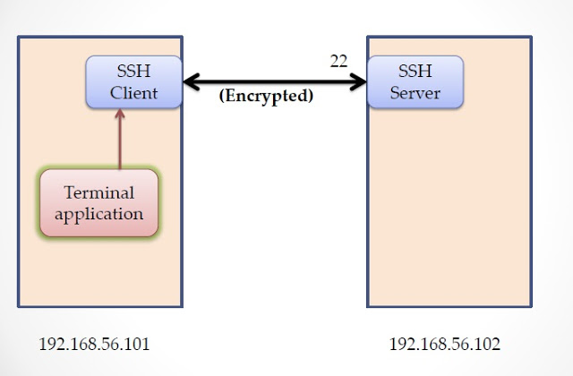

Figura 38: Tunelamento SSH.

Uma das primeiras soluções possíveis é o SSH (porta 22) para se comunicar com o _Private Server_ (192.168.56.102) e depois acessar máquina Intranet (10.10.1.11).  O servidor online pode oferecer alguns serviços de acesso remoto além do SSH como VNC, HTTP e SFTP.

O SSH (Secure Shell) é incluído no Raspbian, onde é possível dizer ao servidor para iniciar automaticamente no boot através do menu Raspi-config. Se o seu Pi tem seu próprio endereço IP ou você está usando o encaminhamento de porta, você deve ser capaz fazer login remotamente de qualquer lugar usando um outro cliente SSH. Como o SSH é criptografado, a segurança não deve ser um problema.

O SSH pode ser encapsulado, permitindo que o servidor SSH possa ser acessado de qualquer lugar, mesmo que por trás de um firewall. Isto é muito útil para a administração remota, _backups_ automáticos ou simplesmente copiar e mover arquivos.

Dessa forma, é possível conectar ao seu Raspberry Pi de outro computador em qualquer lugar do mundo através da Internet. Um método comum é a abertura de porta (internet-intranet) no roteador. Dessa forma, o encaminhamento de portas requer que você altere as configurações do roteador. Você deve configurar seu roteador para encaminhar o tráfego da Internet entregues no seu endereço IP público em um número de porta TCP específica vinculado ao endereço IP da rede local do Raspberry Pi. A maioria dos roteadores tem esse recurso disponível através da página de configuração. No entanto, cada roteador é diferente e o conjunto de instruções para isso não é padrão É necessário consultar o manual de instruções do roteador. Além disso, as configurações podem ser complicadas se o Rpi está atrás de um firewall, ou atrás de mais de um roteador. Outra desvantagem na abertura de porta é que deixa uma porta TCP em seu endereço IP público aberto na Internet. Esta é uma vulnerabilidade de segurança bem conhecido e deve ser realizada com cautela.

Um método alternativo para o encaminhamento de porta é o uso de serviços do Weaved, um software gratuito que você pode instalar no Raspberry Pi, que permite conexão ao Rpi de qualquer lugar através da Internet. SSH, VNC, HTTP, SFTP ou qualquer outra porta TCP (ou "serviço TCP") pode ser ativado, de forma segura, através da Internet sem a abertura de porta.

Por exemplo, para permitir conexões SSH para o seu Raspberry Pi através da Internet usando qualquer software cliente SSH padrão, basta seguir as instruções em:

[https://developer.weaved.com/portal/members/betapi.php](https://developer.weaved.com/portal/members/betapi.php)

*   1.  Configurando o WiFi no Raspberry Pi com USB dongle

| **sudo nano /etc/network/interfaces** |
| --- |

Escreva:

| **auto wlan0** |
| --- |

Pressione:

| **ctrl+x** |
| --- |

*   1.  Raspberry como Servidor

O diretório /var/www funciona como o Public_html de servidores online. Após colocar a webpage lá basta acessá-la pelo **_IPdoRPI/nomedoarquivo_**. Mais detalhes em: [https://www.youtube.com/watch?v=M92qRryaMc8](https://www.youtube.com/watch?v=M92qRryaMc8)

**Tutorial führen**: [http://www.raspberry.bplaced.net/raspberry/web.php](http://www.raspberry.bplaced.net/raspberry/web.php)

*   1.  A instalação de um servidor web e transferência de um Website

| **https://code.google.com/p/webiopi/wiki/INSTALL** |
| --- |

Para simplificar este assunto, vou dividir os sites em duas categorias: Dinâmicas e Estáticas.

**Páginas Estáticas**: Paginas que são feitas apenas utilizando HTML e CSS.

São construídas utilizando somente a linguagem HTML (com CSS ou Java Script). Essas páginas ficam armazenadas no servidor e quando um internauta chama a página, através de uma solicitação feita ao servidor onde está hospedada, o mesmo entrega a página possibilitando o _browser_ ler conteúdo do html, css, os textos e as imagens apresentando o conteúdo ao internauta.

**Páginas Dinâmicas**: Páginas que usam algum tipo de linguagem dinâmica como PHP, .NET entre outras.

Páginas Dinâmicas com código, em PHP por exemplo, funcionam da seguinte forma: O programador monta o site em PHP, as arquivos PHP do site são publicados no servidor. Quando um internauta solicita a página, o servidor processa o PHP e entrega o código já processado em HTML. Isso acontece porque o PHP é pré-processado no servidor e não no _browser_ da máquina do internauta.

Controlar os LEDs remotamente com SSH é interessante, mas a interface (console) não é muito amigável, pois é necessário digitar linhas de comandos. Por isso que é muito utilizado interface gráfica para os projetos.

 Programar um _front-ends_ para comunicar os diversos SOs (IOS, Android, Windows Phone, etc.) a um Rpi seria necessário conhecer diferentes linguagens.     É por isso que um site é a melhor solução, que é compatível com todos os dispositivos e é necessário "apenas" conhecer um pouco de quatro linguagens: HTML (para o esqueleto da página), CSS (o estilo de página), PHP (linguagem interpretada no servidor) e JavaScript (Interações com o usuário). É importante salientar que JavaScript não tem nada a ver com Java. JavaScript é uma linguagem de programação _client-side_ para auxilio na criação de sites. Ela é utilizada para controlar o HTML e o CSS e manipular comportamentos na página como, por exemplo, o surgimento de submenus ao passar o mouse.

As funções escritas em JavaScript podem ser embutidas dentro de seu documento HTML, possibilitando o incremento das funcionalidades do seu documento HTML com elementos interessantes. Sendo possivel responder facilmente a eventos iniciados pelo usuário, incluir efeitos que tornem páginas dinâmicas. Dessa form, é possível dizer que JavaScript é mais uma extensão do HTML do que uma linguagem de programação propriamente dita.

Em documentos HTML, a utilização da linguagem JavaScript, se dá sob a forma de funções (_applets_), as quais são chamadas em determinadas situações ou em resposta a determinados eventos, estas funções podem estar localizadas em qualquer parte do código HTML, a única restrição é que devem começar com a declaração &lt;SCRIPT&gt; e termina com o respectivo &lt;/SCRIPT&gt;.

| //http://www.w3schools.com/js/tryit.asp?filename=tryjs_myfirst |
| --- |

Dessa forma, quando o Rpi é configurado como servidor HTML, é necessário instalar apenas o software servidor HTTP Apache (**_apt-get install apache2_**), quando é configurado como servidor PHP, é necessário instalar também o pré-processador PHP (apt-get install php5 libapache2-mod-php5), ou seja, para instalação completa basta, depois de atualizar o Rpi com o comando "**_sudo apt-get upgrade_**", digitar "**_sudo apt-get install apache2 php5 libapache2-mod-php5_**". Agora é possível testar se o servidor está funcionando, digitando o IP do Rpi em algum browser e surgirá uma página indicando "It works!".

Se não funcionou, em seguida, verifique o IP, tente reinstalar o Apache ou reiniciar o Raspberry Pi. A página com "It´s work!" está mostrando que o servidor Apache está funcionando corretamente, mas não sua extensão PHP. Para verificá-lo, navegue até o diretório "/var/www/" usando o comando "**_cd /var/www/_**". O diretório **_/var/www/_ **funciona no Rpi como o Public_html nos servidores convencionais.

Se você usar o comando "**_ls_**", você deve ter apenas um arquivo denominado "index.html". Este arquivo corresponde à página"It´s work!". É possível excluí-la com excluí-lo ("**_sudo rm index.html_**") e criar um outro chamado "index.php" (use " **_sudo nano index.php_** "). Em seguida, digite o seguinte texto:

| _<?php_ |
| --- |

Depois de salvar o editor nano usando ^ o (Ctrl + O), e saindo com ^ x (Ctrl + X). Agora, se você atualizar seu navegador, você deve ver uma longa página com muita informação sobre o seu servidor e PHP. Se você não fizer isso, verifique o arquivo index.php, tente reinstalar o PHP ou tentar entender o erro exibido na página (Google).

  Se Ambas as páginas foram corretamente exibido, então agora você tem um servidor Apache/PHP totalmente funcional, mas usando nano toda vez que é irritante e não muito confortáveis.

Nós realmente precisamos para transferir arquivos de seu computador para o Raspberry Pi. Você pode querer instalar um servidor FTP, mas não é necessário, você já pode transferir arquivos usando o protocolo SFTP. Tudo que você precisa é de SFTP cliente em seu computador como o WinSCP ou Filezilla para Windows, Cyberduck para Mac ou Filezilla para Linux. Se você tentar transferir arquivos antes de ler o que está próximo, você provavelmente vai ter problemas tais como: "Acesso recusado" ou "não pode escrever aqui". É devido ao factthat o pi usuário não possuir o diretório www. Na verdade, se você tentar o comando "**_ls -l /var/www_** ", você verá que somente o root (superusuário) é possuir o diretório www. Você pode (como eu fiz) usar o "sudo chown -R pi / var / www" comando para alterá-lo ou criar um grupo chamado www-data em que coloca o usuário PI, em seguida, usar o comando "sudo chown -R www-data / var / www ". A bandeira -R está de pé para recursiva, isso significa que o usuário / grupo não só é proprietária do diretório em si, mas para que tudo dentro (index.php como exemplo).

     Agora você tem seu servidor pronto para trabalhar e receber páginas da web. Divirta-se!

Dicas:

- Para corrigir acentuação dos caracteres no php, basta inserir no início do código:

| <?php |
| --- |

*   1.  CURL no PHP

Para testar o resgate de conteúdo de um arquivo utilizando PHP basta utilizar a biblioteca cURL.Para verificar se ela já não está habilitada no seu servidor teste com uo comando phpinfo(); em um arquivo .php.

Se aparecer cURL support, a bilbioteca está instalada. Se não, procure por ;extension=php_curl.dll no arquivo php.ini do servidor e retire o comentário (;). Abaixo um exemplo de código testado em php que resgata o conteúdo de um arquivo .txt.

| <?php |
| --- |

*   1.  Copiar arquivos do PC para o Raspberry Pi com Filezilla e vice-versa

Uma das melhores ferramentas é utilizar o SSH _File Transfer Protocol_ ou SFTP. Nesse caso, SSH significa _Secure Shell_). Para isso, se utiliza o Filezilla (Figura 37) com configuração mostrada na figura abaixo a apartir do IP do Rpi na rede. Nesse caso, o Host é o IP, o Nome do usuário é pi, a senha é raspberry e a Porta SFTP é 22.

Figura 39: Filezilla.

Há uma série de programas que você pode baixar para ajudá-lo com isso, mas é recomendado o FileZilla.

**Programando em shell script**

[http://www.devin.com.br/shell_script/](http://www.devin.com.br/shell_script/)

[http://www.devmedia.com.br/introducao-ao-shell-script-no-linux/25778](http://www.devmedia.com.br/introducao-ao-shell-script-no-linux/25778)

Quem usa Linux conhece bem o prompt de comando sh, ou variações como o bash. O sh ou o bash têm uma “poderosa” linguagem de script embutido nelas mesmas – shell script. Diversas pessoas utilizam-se desta linguagem para facilitar a realização de inúmeras tarefas administrativas no Linux, ou até mesmo criar seus próprios programas. Patrick Volkerding, criador da distribuição Slackware, utiliza esta linguagem para toda a instalação e configuração de sua distribuição. Você poderá criar scripts para automatizar as tarefas diárias de um servidor, para efetuar _backup_ automático regularmente, procurar textos, criar formatações, e muito mais. Para você ver como esta linguagem pode ser útil, vamos ver alguns passos introdutórios sobre ela.

Interpretadores de comandos são programas feitos para intermediar o usuário e seu sistema. Através destes interpretadores, o usuário manda um comando, e o interpretador o executa no sistema. Eles são a “Shell” do sistema Linux. Usaremos o interpretador de comandos bash, por ser mais “extenso” que o sh, e para que haja uma melhor compreensão das informações obtidas aqui, é bom ter uma base sobre o conceito de lógica de programação.

Uma das vantagens destes shell scripts é que eles não precisam ser compilados, ou seja, basta apenas criar um arquivo texto qualquer, e inserir comandos à ele. Para dar à este arquivo a definição de “shell script”, teremos que incluir uma linha no começo do arquivo (#!/bin/bash) e torná-lo “executável”, utilizando o comando chmod. Vamos seguir com um pequeno exemplo de um shell script que mostre na tela: “Nossa! Estou vivo!”:

| **_#!/bin/bash_** |
| --- |

Fácil, hein? A primeira linha indica que todas as outras linhas abaixo deverão ser executadas pelo bash (que se localiza em /bin/bash), e a segunda linha imprimirá na tela a frase “Nossa! Estou vivo!”, utilizando o comando echo, que serve justamente para isto. Como você pôde ver, todos os comandos que você digita diretamente na linha de comando, você poderá incluir no seu shell script, criando uma série de comandos, e é essa combinação de comandos que forma o chamado shell script. Tente também dar o comando ‘file arquivo’ e veja que a definição dele é de Bourne-Again Shell Script (bash script).

Contudo, para o arquivo poder se executável, você tem de atribuir o comando de executável para ele. E como citamos anteriormente, o comando chmod se encarrega disto:

| **$ chmod +x arquivo** |
| --- |

Pronto, o arquivo poderá ser executado com um simples “./arquivo”.

- See more at: http://www.devin.com.br/shell_script/#sthash.LjaT8rLk.dpuf

*   1.  Dropbox no Raspberry

Dropbox Uploader é um script que pode ser usado para carregar, descarregar a excluir arquivos do Dropbox e para compartilhamento online de arquivos, sincronização e serviço de _backup_. Dessa forma, este aplicativo pode funcionar como um compartilhador de arquivos no modo internet em conjunto com o Samba que compartilha no modo intranet.

O Dropbox Uploader é também:

Portátil: Está escrito em script BASH e Uploader necessita apenas que o usuário tenha instalado a biblioteca cURL (sudo apt-get install curl).

Seguro: Não é obrigado fornecer o nome de usuário/senha para esse script, porque ele usa o sistema de API do Dropbox para o processo de autenticação.

**Características:**

*   Multiplataforma:
*   Suporte para a API oficial Dropbox
*   Não é necessário senha
*   Simples passo-a-passo assistente de configuração
*   Exclui, move, renomeia, copiar e lista arquivos
*   Cria link de compartilhamento

*   *   1.  Comandos:

*   **upload** – Para fazer upload de ficheiros locais para o serviço
*   **download** – download de ficheiros do Dropbox para directorio local
*   **delete** – Apagar um ficheiro remoto no Dropbox
*   **mkdir** – Criar diretórios no Dropbox
*   **list** – listar conteúdo de um diretório no Dropbox
*   **share** – partilhar conteúdos
*   **info** – informações sobre a conta do Dropbox
*   **unlink** – desconecta da API/pasta atual do dropbox

Instalando:

| root@raspberrypi:~# **git clone https://github.com/andreafabrizi/Dropbox-Uploader.git** |
| --- |

Cloning into 'Dropbox-Uploader'...

remote: Counting objects: 654, done.

remote: Total 654 (delta 0), reused 0 (delta 0)

Receiving objects: 100% (654/654), 201.07 KiB | 277 KiB/s, done.

Resolving deltas: 100% (328/328), done.

| root@raspberrypi:~# ls |
| --- |

Esta é a primeira vez que você executar este script.

1) Abra a seguinte URL no seu navegador e fazer login usando sua conta: **https://www.dropbox.com/developers/apps**

2) Clique em "Criar App", em seguida, selecione "app API Dropbox"

3) Selecione " app API Dropbox"

4) Agora, vá em frente com a configuração, escolha as permissões de aplicativos e restrições de acesso a sua pasta DropBox.

**Pode seu app ser limitada a sua própria pasta?**

Sim. Meu aplicativo só precisa de acesso a arquivos que ele cria. Este é caracterizado por App Folder em https://www.dropbox.com/developers/apps.

**Não. Meu aplicativo precisa de acesso a arquivos que já participam do Dropbox.** Este é caracterizado por Full Dropbox em https://www.dropbox.com/developers/apps.

**Que tipo de arquivos que seu aplicativo precisa de acesso?**

Tipos de arquivos específicos. Meu aplicativo só precisa de acesso a determinados tipos de arquivo, como texto ou fotos.

**Todos os tipos de arquivos. Acesso completo ao Dropbox**.

5) Digite o "App Name" que você prefere (por exemplo SyncUSB19)

Agora, clique no botão "Criar App".

Quando o novo App é criado com sucesso, por favor, digite o

A chave do App, a senha e o tipo de permissão mostrado na página de confirmação do dropbox:

# App key: **kh18rq3keosqd95**

# App secret: **z9igzvhf35vgp47**

# tipo de permissão, pasta do App ou Dropbox completo [a/f]: **f**

Por favor, abra a seguinte URL no seu navegador, e permita que Dropbox Uploader possa acessar sua pasta DropBox:

--> https://www.dropbox.com/sh/uhphv9w5b101hgy/AABX6dGVsF2PIgAb_bg5Ons_a

--> https://www.dropbox.com/sh/uhphv9w5b101hgy/AABX6dGVsF2PIgAb_bg5Ons_a?dl=0

Pressione Enter quando abrir o link acima no browser...

> **Access Token request... OK**

**Exemplos:**

**Upload com criação de uma nova pasta no dropbox:**

**//endereço absoluto do script dropbox_uploader.sh + upload + endereço absoluto do arquivo + nome da pasta e arquivo para o dropbox**

| root@raspberrypi:/var/www# /home/share/Dropbox-Uploader/./dropbox_uploader.sh upload /var/www/index.html /PastaGeradaPeloRpi/index.html |
| --- |

Se a escolha de configuração inicial foi: _Sim. Meu aplicativo só precisa de acesso a arquivos que ele cria_.O arquivo será alocado em aplicativos: **C:\Users \Dropbox\Aplicativos\** Este é caracterizado por App Folder em https://www.dropbox.com/developers/apps.

Se a escolha de configuração inicial for: **_Não. Meu aplicativo precisa de acesso a arquivos que já participam do Dropbox._** A pasta/arquivo gerada será alocada na pasta padrão do dropbox **C:\Dropbox\.** Foi o caso do exemplo em questão. Este é caracterizado por Full Dropbox em https://www.dropbox.com/developers/apps.

**Download de um arquivo:**

**//endereço absoluto do script dropbox_uploader.sh + download + endereço absoluto da pasta/arquivo do dropbox a partir da raiz (C: \Dropbox\) + nome da pasta e arquivo no Rpi**

| root@raspberrypi:/var/www# /home/share/Dropbox-Uploader/./dropbox_uploader.sh download /PastaGeradaPeloRpi/index.html /var/www/index.html |
| --- |

**list – listar conteúdo de um diretório no Dropbox**

**//endereço do script executável dropbox_uploader.sh + list + endereço absoluto da pasta do dropbox a partir da raiz (C: \Dropbox\)**

| root@raspberrypi:/home/share/Dropbox-Uploader# ./dropbox_uploader.sh list PastaGeradaPeloRpi/ |
| --- |

[F] 677 blink.c

Para linkar a API gerada com outros usuários, basta instalar e executar o ./dropbox_uploader.sh em outros RPIs e inserir a App key: kh18rq3keosqd95 e App secret: z9igzvhf35vgp47 , como por exemplo da API SyncUSB19, e depois confimar abrindo pelo browser a URL da API sugerida pela instação como [https://www.dropbox.com/developers/apps/info/kh18rq3keosqd95](https://www.dropbox.com/developers/apps/info/kh18rq3keosqd95)

*   1.  Banco de dados estruturado MySQL

MySQL é um banco de dados relacional, e um servidor multiusuário, multitarefa, compatível com o padrão SQL (Structured Query language – Linguagem de Consulta estruturada), linguagem essa amplamente utilizada para manipulação de dados em RDBMS (Banco de dados Relacionais), sendo considerada um ferramenta de manipulação de base de dados de tamanho moderado.

As principais características que destacam MySQL são: sua velocidade proporcionada pela sua implementação leve que não inclui na totalidade o suporte as instruções SQL; sua natureza de distribuição gratuita; facilidade de integração com servidor Web e linguagens de programação de desenvolvimento de sites dinâmicos, especialmente a linguagem PHP.

**Principais características:**

*   1.  Permite operações e funções nas cláusulas select e where, bem como suporte as funções SQL(group by , order by ), além de funções de grupo como: Count(), avg(), sum(), std(), max(), min().
    2.  Permite a seleção de diferentes tabelas de diferentes bases de dados em uma mesma query.
    3.  Suas características de privilégio de password são bastante flexíveis, permitindo inclusive a validação por “host”.
    4.  Possui algoritmos de criptografia de password, fornecendo assim segurança aos dados gravados nas tabelas.
    5.  Permite a utilização de até 16 índices por tabela.
    6.  Capacidade para manipular bancos com até 50 milhões de registros.
    7.  MySQL foi escrito em C e C++.
    8.  Permite conexões via TCP/IP.

O banco de dados MySQL suporta a utilização de procedures e triggers. A utilização de procedures possibilita que vários processos de programação sejam efetuados no próprio banco de dados, permitindo assim a diminuição do tráfego cliente-servidor bem como benefícios no que diz respeito a independência de aplicativos, pois os processos implementados no banco ficam transparentes para a aplicação que acessa os dados. Pode-se definir trigger como sendo um ou vários procedimentos armazenados que são executados quando determinado evento ocorre, por exemplo, a cada vez que um registro é atualizado dispara-se a execução de certos procedimentos. Trecho de código abaixo com trigger para guardar nova senha inserida:

| mysql> CREATE TRIGGER user_au AFTER UPDATE |
| --- |

Todas as informações referentes à controle de acessos e privilégios ficam armazenas em uma base de dados (**_show databases;_**) dentro do MySQL chamado mysql (**_use mysql;)_** , com as informações sobre usuários especificadas dentro de uma tabela (**_show tables;_**) com o nome de user. Esta tabela possui a seguinte estrutura de dados assim explicada:

Tabela 1: Tabela user do MySQL.

| Campo | Tipo | Funçao |
| --- | --- | --- |
| Host | Char(60) | Host a qual se dará o acesso ao banco |
| User | Char(16) | Nome do usuário |
| Password | Char(16) | Senha do usuário (Campo pode ser criptografado) |
| Select_priv | Enum(‘n’,’y ‘) | Possibilidade de executar o comando select |
| Insert_priv | Enum(‘n’,’y ‘) | Possibilidade de executar o comando insert |
| Update_priv | Enum(‘n’,’y ‘) | Possibilidade de executar o comando update |
| Delete_priv | Enum(‘n’,’y ‘) | Possibilidade de executar o comando delet |
| Create_priv | Enum(‘n’,’y ‘) | Possibilidade criar banco de dados |
| Drop_priv | Enum(‘n’,’y ‘) | Possibilidade de apagar banco de dados |
| Reload_priv | Enum(‘n’,’y ‘) | Possibilidade de atualizar os privilégios definidos |
| Shutdown_priv | Enum(‘n’,’y ‘) | Possibilidade de finalizar o servidor |
| Process_priv | Enum(‘n’,’y ‘) | Possibilidade de gerenciar tarefas em execução |
| File_priv | Enum(‘n’,’y ‘) | Possibilidade de usar comandos que executam sobre arquivos |
| Grant_priv | Enum(‘n’,’y ‘) | Possibilidade de definir privilégios para outros usuários |
| Index_priv | Enum(‘n’,’y ‘) | Possibilidade de criar e apagar índices |
| Alter_priv | Enum(‘n’,’y ‘) | Possibilidade de executar o comando ALTER TABLE |

_Outras tabelas completam o controle total de permissões e privilégios:_

**DB** – esta tabela possui as informações de qual usuário pode executar quais comandos, de determinada máquina, exatamente sobre um banco de dados específico. Esta tabela se faz necessária, pois a tabela user não possui qualquer referência sobre quais bancos de dados eram definidos os privilégios, assim com a tabela db pode ter um controle mais específico.

**Host** – esta tabela tem por objetivo controlar o acesso a banco levando em consideração em qual máquina esta sendo efetuada a conexão, assim se a tabela db não identificar o host para um banco de dados e usuário, a tabela host define se o banco de dados em questão pode ser acessado de determinado host.

*   *   1.  Conexão ao MySQL de um servidor online

O processo de conexão com o banco requer que alguns parâmetros sejam passados ao servidor MySQL:

1.  Hostname – Qual computador deseja efetuar a conexão.
2.  usuário – O nome do usuário que deseja se conectar ao banco
3.  A senha – Senha do usuário que requisitou a conexão.

Esses dados são passados para o servidor através da aplicação cliente, por exemplo um página desenvolvida em PHP ou um módulo de administração.

Abaixo o exemplo de uma conexão através da linguagem PHP embutida em uma página HTML:

1.  $conexao = mysql_conect (‘localhost’,’ sanusbor _1’,’xxxyyy’);
2.  mysql_select_db(‘conexao’,’ sanusbor _ms’);

Com a função nº 1 nativa da linguagem PHP, solicita-se uma conexão ao servidor MySQL, sendo o lugar da conexão o próprio servidor(localhost), o usuário (a6132965_1) e a sua senha(xxxyyy). Caso executado com sucesso a função, a variável $conexao recebe a validação da conexão. A segunda função seleciona qual o banco de dados que a conexão acima realizada deseja conectar, nesse caso foi conectado ao banco de dados a6132965_ms. Exemplo:

| <?php |
| --- |

O vídeo exemplo em [https://www.youtube.com/watch?v=pwuXOmpGJoU](https://www.youtube.com/watch?v=pwuXOmpGJoU) demonstra um acesso remoto a um led de um raspberry através de uma página php que é atualizada a cada 10 segundos para conectar a um banco na nuvem e verificar uma _flag_ desse banco de dados de um servidor online. Essa flag pode ser alterada por qualquer software na internet de acesso ao banco, como o PhpMyAdmin. O símbolo % na configuração do MySQL remoto permite que qualquer IP de cliente, como o Rpi, possa acessar o banco criado no servidor online. Acript PHP abaixo:

| <?php |
| --- |

Testando a Liberação do IP para acesso remoto ao MySQL remoto do servidor online: [https://www.youtube.com/watch?v=sodbMGrxdcE](https://www.youtube.com/watch?v=sodbMGrxdcE). O banco MySQL _server_ pode ser instalado no servidor online com MySQL _client_ no Rpi, mais adequado para aplicação com ioT, ou MySQL _server_ no Rpi, adequado para apliações locais.

Para se se conectar ao MySQL remoto via shell, é necessário fornecer também o nome de usuário, senha e o nome do servidor em que o banco está hospedado:

| **_mysql -u nome-do-usuario -p senha -h nome-do-servidor nome-do-banco-de-dados_** |
| --- |

Seguindo o exemplo acima, ficaria assim:

| **_mysql -u sanusbor_1 -p laese -h sanusb.org sanusbor_ms_** |
| --- |

**Instalando o MySQL Server no Raspbian**

Para a instalação é só seguir os passos a baixo: http://thobias.org/doc/shell_bd.html

1.  No teminal do Raspbian digite como root os comandos a baixo:

| **_apt-get update_** |
| --- |

Obs.: Para desinstalar basta digitar: **_sudo apt-get remove --purge mysql\*_**

Remova todas as pastas (**_rm –r pasta_**) encontradas com **_find / -name "mysql"_**.

O php5-mysql adiciona as bibliotecas mysql para permitir que o PHP possa acessar o banco de dados mysql. Durante a instalação será pedido para criar uma senha (ex. 1234).

*   *   1.  Comando do MySQL

Para alterar o nível dos pinos no banco de dados é só utilizar os comandos:

1.  Conecte com o banco de dados usando o comando

| **_mysql -p -u root ou_** |
| --- |

Importe o arquivo fonte para a base de dados:

| **_# source “local de origem”/”arquivo”.sql_** |
| --- |

Exemplo: _source /var/www/gpio/gpio.sql_

1.  Para mostrar todos os bancos de dados digite o comando a seguir conforme Figura 38.

| **_show databases;_** |
| --- |

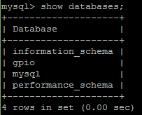

Figura 40: Database.

Para modificar a base de dados (database), basta digitar: use db.

Exemplo:

| **_use mysql; use gpio;_** |
| --- |

Para mostrar todas as tabelas do banco importado gpio.sql digite conforme Figura 39:

| **_show tables;_** |
| --- |

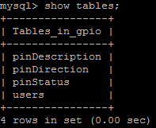

Figura 41: Tabelas do banco MySQL.

1.  Para alterar quaisquer status dos pinos gpio do raspberry no banco de dados é só usar o comando:

| **_UPDATE pinStatus SET pinStatus = '0 ou 1' WHERE pinNumber = 'nº bcm do pino desejado';_** |
| --- |

1.  Para mostrar uma tabela de estatus dos pinos use:

| **_SELECT * FROM pinStatus_** |
| --- |

*   *   1.  Atualizando o Raspberry Pi

Para executar arquivos .sql utiliza-se os seguintes comandos:

Para para copiar a pasta completa para dentro de www devemos executar o comando:

| **_cp –r “/endereço da pasta gpio” /var/www/_** |
| --- |

Lembrando que é necessário dar permissões de execução na pasta www e que é necessário alterar o usuário e senha do banco de dados nos arquivos .php e .sh para a senha criada no momento da instalação do mysql, pois os mesmos estão com valores padrão e vão precisar de conexão com o banco de dados instalado:

| **_cd /var_** |
| --- |

Para que as alterações do banco de dados sejam realizadas no raspberry é necessario rodar um script GPIOServer.sh, para isso basta executá-lo:

| **_chmod +x GPIOServer.sh_** |
| --- |

Esse script é responsavel por verificar o banco de dados passando as alterações realizadas no banco de dados para o RPI. O script pode continuar rodando enquanto são feitas alterações no banco de dados, usando os comandos do mysql. Para o exemplo em questão ilustrado em [http://youtu.be/s67GjlMeITc](http://youtu.be/s67GjlMeITc) . Se acessar o endereço **_IPdoRpi/gpio/index.php_** ou simplesmente **_IPdoRpi/gpio_** irá solicitar uma senha que foi cadastrada como admin (usuário) e gpio (senha).

*   1.  Instalando o MySQL Client

1\. Para instalar o MySQL client que é muito mais leve que o server, utilize o comando:

| **_apt-get install mysql-client_** |
| --- |

2\. Para prover suporte às bibliotecas em C no MySQL instale:

| **_# sudo apt-get install libmysqlclient-dev_** |
| --- |

3\. Para compilar, insira #include <my_global.h> e #include <mysql.h> no cabeçaho e considere as bibliotecas adicionais.

| gcc -o exemploBD exemploBD.c -l wiringPi **_$(mysql_config --libs --cflags)_** |
| --- |

Abaixo um exemplo de conexão direta com um banco MySQL de um servidor na nuvem:

| #include <stdio.h> //http://sanusb.org/gpio/indexmysql.php |
| --- |

*   1.  Banco de dados estruturado SQlite

SQLite é uma boa opção de banco de dados para sistemas embarcados Linux por uma série de motivos:

*   É fácil de instalar.
*   É livre e _open source_.
*   Os bancos de dados são armazenados em um único arquivo que é possível se conectar diretamente a partir de seu código, sem a necessidade de um processo de servidor em execução.
*   A bibliotecas são customizadas, ou seja, ocupa menos espaço no disco.
*   E ainda um software que está sendo usado em muitos produtos bem conhecidos, tais como o Mozilla Firefox, Apple, Dropbox e Google.

O uso do SQLite é recomendado onde a simplicidade da administração, implementação e manutenção são mais importantes que incontáveis recursos que SGBDs mais voltados para aplicações complexas possivelmente implementam. As situações onde a simplicidade é a melhor escolha são muito mais freqüentes do que pode-se imaginar.

Exemplos de uso do SQLite são:

*   Sites com menos de cem mil requisições por dia
*   Dispositivos e sistemas embarcados
*   Aplicações desktop
*   Ferramentas estatísticas e de análise
*   Aprendizado de banco de dados
*   Implementação de novas extensões de SQL

Não se recomenda o uso do SQLite para sites com:

*   Muitos acessos
*   Grande quantidades de dados (talvez maior que algumas dúzias de gigabytes)
*   Sistemas com grande concorrência
*   Aplicações cliente/servidor

SQLite:

*   É Software Livre/domínio público e multiplataforma
*   É um mecanismo de armazenamento seguro com transações ACID
*   Não necessita de instalação, configuração ou administração.
*   Implementa a maioria do SQL92
*   Permite guardar o banco de dados em um único arquivo
*   Suporta bases de dados abaixo de 2 terabytes
*   Não tem dependências externas

*   *   1.  **Instalação**

Para instalar, basta digitar:

| **_sudo apt-get install sqlite3_** |
| --- |

**Criando seu primeiro banco de dados**

O SQLite trata as bases de dados num único arquivo, ou seja, o nome do banco de dados corresponderá ao nome do arquivo que o SQLite criará nesta fase. Para este exemplo iremos chamá-lo MyFirstDatabase.db e nós vamos guardá-lo na pasta de início padrão. Então, ainda no mesmo tipo de linha de comando:

| **_sqlite3 MyFirstDatabase.db _** |
| --- |

Ao digitar aparecer o prompt do SQLite, como abaixo:

Agora é possível adicionar dados ao banco. 

*   *   1.  **Criando sua primeira Tabela**

No SQLite, os dados são armazenados em tabelas que, conceitualmente, parece muito com tabelas de dados que você iria encontrar no mundo real (ver Figura 42). 

Figura : Tabela exemplo banco de dados.

Primeiro, é necessário criar a tabela e, em seguida, adicionar os dados à essa tabela. Para fazer ambas as tarefas podemos usar uma linguagem chamada SQL, que é abreviação de "_Structured Query Language_". Embora SQL não seja estritamente uma linguagem de programação, mas adaptado especificamente para consultar dados, o SQLite é um programa que permite executar comandos tradicionais SQL, como é o caso Oracle, MySQL, entre outros. Cada um deles tem particularidades, mas os comandos básicos são os mesmos em todos os programas de banco de dados estruturados. Para criar a tabela, digite ao prompt **_sqlite>_**, como mostrado abaixo, e pressione Enter: 

| **_CREATE TABLE fruta ( nome TEXT, calorias INT, preco NUMERIC);_** |
| --- |

Para facilitar, todos os comandos em cor azul são comandos SQL e devem ser inseridos no prompt **_sqlite>_**. Todos os comandos em cor preta devem ser introduzidos no prompt de comando Linux padrão $.

É necessário o ponto e vírgula no final do comando SQL. Se não for inserido basta colocá-lo na linha seguinte e pressionar Enter. É isso aí, você acabou de criar uma tabela chamada de fruta. 

Bem, fruta é o nome da tabela que criamos e que iremos utilizar para se referir à tabela quando se quiser inserir e ler os dados,  nome, calorias e preço são os nomes das três colunas; TEXTO, INT e NUMERIC são os tipos de dados para as colunas correspondentes. 

Para qualquer um que tenha usado quaisquer outros bancos de dados SQL, no passado, é importante notar aqui que SQLite usa um sistema de tipo de dados dinâmicos. Isto significa que você pode realmente armazenar qualquer tipo de dados em qualquer coluna. Para sair SQLite do banco criado **MyFirstDatabase.db**,  digite: 

| **.exit** |
| --- |

e depois listar os arquivos:

| **ls** |
| --- |

e é possível ver nosso banco de dados recém-criado.

 **Inserção de dados**

Bem, agora temos uma tabela. O próximo passo é inserir alguns dados usando SQL.  É necessário reconectar-se ao banco de dados com o mesmo comando como antes **_sqlite3 MyFirstDatabase.db _**

Em seguida, para inserir a primeira linha de dados você pode ver na tabela acima, nós digitamos

 **_INSERT INTO fruta values("Framboesa", 60, 4.99);_**

Repita para as próximas duas linhas:

**_INSERT INTO fruta values("Banana", 52, 0.79);_**

**_INSERT INTO fruta values ("Laranja", 85, 2.5);_**

**Consultando os Dados**

Para ver todos os dados (*) que está numa tabela em particular, usamos o comando de seleção SQL. 

**_SELECT * FROM fruta;_** 

É mostrado as três linhas de dados que acabamos de adicionar: 

Assim é visto todas as colunas. Para ver um subconjunto de colunas, como nome e preço, basta digitar (antes de _FROM_) :

**_SELECT nome, preco FROM fruta;_**

Para filtrar um subconjunto específico de linhas precisamos da cláusula **WHERE**. Por exemplo, o comando**_SELECT * FROM fruta WHERE preco > 3;_**

Mostra a linha em que o preço é maior do que 3\. E o comando abaixo mostra a linha com o nome Banana:

**_SELECT * FROM fruta WHERE name = "Banana";_**

O comando SELECT é realmente um dos principais comandos da linguagem SQL.

**Excluindo Dados**

Para remover dados da tabela, em seguida, é possível utilizar o comando DELETE. que é muito semelhante ao comando SELECT assim:

**_DELETE FROM fruta WHERE nome = "Framboesa"; _**

DICA: Se você quiser adicionar novamente os dados que você acabou de excluir, uma maneira rápida de fazer isso é para pressionar a seta para cima na linha de comando para voltar a inserir comandos que você inicialmente utilizou para adicionar os dados e apenas pressione Enter.

**Usando phpLiteAdmin com Raspberry Pi**

O phpLiteAdmin que é uma ferramenta _front-end_ baseada em PHP para gerenciar e manipular bancos de dados com SQLite.  Para utilizar o phpLiteAdmin no Rpi como servidor é necessário ter instalado anteriormente:

| **_apt-get install apache2 php5 libapache2-mod-php5_** |
| --- |

E seguir os passos abaixo:

| **_cd /var_** |
| --- |

Agora é necessário renomear e reconfigurar, se necessário, _password_ e _directory_:

| **_cp phpliteadmin.config.sample.php phpliteadmin.config.php_** |
| --- |

Agora, crie um banco de dados exemplo como o **_MyFirstDatabase.db _** do tópico anterior em **_/var/www/admin._**

Para dar permissão de escrita no banco de dados gerado digite:

| **_chown www-data /var/www/admin/_** |
| --- |

Pronto, para acessar e manipular dados com o Phpliteadmin basta abrir com um navegador o endereço IPdoRpi/admin/phpliteadmin.php, exemplo: 192.168.1.7/admin/phpliteadmin. Mais detalhes no vídeo: [https://youtu.be/0adJoqDS9eE](https://youtu.be/0adJoqDS9eE).

É possível notar no vídeo que a aba _Structure_ insere e configura as colunas da tabela fruta, e a aba _Insert_ é utilizada para inserir as linhas de dados da tabelas.

Veja um exemplo de criação de um novo banco de dados :

O SQLite trata as bases de dados num único arquivo, ou seja, o nome do banco de dados corresponderá ao nome do arquivo que o SQLite criará nesta fase. Para este exemplo será chamado Temperatura.db e vai ser guardado na pasta compartilha no samba.

Então, ainda no mesmo tipo de linha de comando:

- Sqlite3 Temperatura.db

A tabela será criada no banco de dados utilizando o phplite admin e ficará da seguinte forma.

Para finalizar iremos inserir dados na base e imprimir através do phpLite admin segue imagem:

*   1.  Modificar o nome do Rpi

Para alterar o nome basta inserir as três linhas de comando abaixo no terminal:

| **_nano /etc/hostname_** _(mudar o hostname para o novo nome)_ |
| --- |

*   1.  Modificar a senha do Usuário pi

| **_pi@raspberrypi: ~$_ **_passwd_**** |
| --- |

*   1.  Modificar data, hora e fuso horário do Rpi

É possível, através do “raspi-config”, alterar a data, hora e fuso horário do Rpi. Basta digitar este comando com o usuário root (sudo su). Siga o passo a passo mostrado nas figuras abaixo:

*   *   1.  Selecione a opção 4:

*   *   1.  Selecione a opção I2 para configurar o fuso horário:

*   *   1.  Selecione América:

*   *   1.  E por último, Fortaleza. Para sair, OK.

*   1.  Configurar o teclado para uso local

Para configurar o teclado, caso use o Rpi de forma local, sem acesso remoto, com monitor, mouse e teclado acoplado a este, basta selecionar a opção I3 dentro do menu 4 (Internationalization Options).

*   1.  Criar, ler e escrever em um arquivo via Shell

O exemplo abaixo mostra um código exemplo em shell script para criar, ler e escrever em um arquivo shell.

| **Illegal nested table :** Field NameValores permitidosCaracateres especiais permitidosSegundos (não default no Rpi)0-59- * / Minutos0-59- * /Horas0-23- * /Dias (do mês)1-31* ? / L WMês1-12 ou JAN-DEC- * /Dias (da semana)1-7 ou SUN-SAT- * ? / L #Ano (opcional)vazio, 1970-2199- * / |
| --- |

**Varredura e conexão com Redes WiFi**

Como a comunicação e a programação do Rpi é realizada em modo online, é necessário que o Rpi sempre tenha acesso à internet. Dessa forma, para que o Rpi possa verificar conexão com Internet de possíveis redes Wifi (selecionadas antes da interface Ethernet), é necessário inserir as configurações de uma ou mais redes WiFi no arquivo /etc/wpa_supplicant/wpa_supplicant.conf como abaixo.

_network={_

_ssid="SSID-HERE"_

_psk="WIFI-PASSWORD -HERE"_

_}_

É possível configurar a rede em modo WiFi através da plataforma de serviço gerada livre e automaticamente em sanusb.org/rs/sanusb.php em que ao executar o script Sloader.sh no Rpi, basta acessar o link de Commands, inserir o comando wf e colocar o SSID e o password nos campos indicados. Assim, Sloader irá configurar a nova rede WiFi automaticamente.

A Figura abaixo mostra a inserção em sequência de duas redes Wifi preconfiguradas via plataforma de serviço que serão selecionadas em sequência com modem WiFi. Se não houver modem WiFi, mesmo com as redes WiFi preconfiguradas, a conexão será estabelecida com a rede Ethernet após reinicialização.

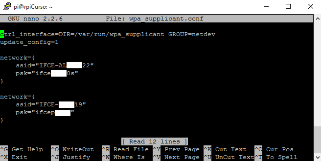

*   1.  Simulação de Comunicação GPIO Raspberry usando php e mysql com raspian no VirtualBox

Muitas vezes desenvolvemos sistemas baseados em um CI, e precisamos de portas de sinalização extra, que não estão disponíveis por padrão no CI. Como as portas GPIO não tem função definida e por padrão não são usadas, podemos usa-las para prover essa sinalização. Um exemplo, são os chips Realtek ALC260(codec de áudio) eles tem 4 pinos GPIO, que não são usados por padrão. A Acer utiliza o primeiro pino GPIO (GPIO0) para ligar o amplificador utilizado para os alto-falantes internos do laptop e fone de ouvido externo.

GPIOs são utilizados em:

Dispositivos com pinos de escassez: circuitos integrados, tais como dispositivos lógicos programáveis system-on-a-chip, embutido e hardware personalizado, e (por exemplo, FPGAs).

Chips Multifuncionais: gestores de energia, codecs de áudio e placas de vídeo.

Aplicações embutidas (por exemplo, Arduino, BEAGLEBONE, kits de PSoC e Raspberry Pi ) fazem uso pesado de GPIO para a leitura de vários sensores ambientais ( IR , vídeo, temperatura , orientação de 3 eixos , e aceleração) , e para escrever a saída para motores DC (via PWM) , áudio, monitores LCD , ou LEDs para status.

GPIO capacidades podem incluir:

GPIO pinos podem ser configurados para estarem de entrada ou de saída.

GPIO pinos podem ser ativados / desativados.

Os valores de entrada são legíveis (normalmente alto=1, baixo=0).

Os valores de saída são graváveis / legível.

Valores de entrada muitas vezes podem ser usados como IRQs (tipicamente para os eventos de ativação).

Periféricos GPIO variar muito amplamente. Em alguns casos, eles são muito simples, um grupo de pinos que podem ser comutados como um grupo , quer de entrada ou de saída . Em outros, cada pino pode ser configurado de forma flexível para aceitar ou fonte de tensões diferentes de lógica, com pontos fortes da unidade configurava e puxe ups / baixos. As tensões de entrada e de saída são tipicamente, embora não universalmente, limitado à tensão do dispositivo com os GPIOs sobre a oferta e pode ser danificado por maiores tensões.

Um estado do pino GPIO pode ser exposto para o desenvolvedor de software através de um de um número de diferentes interfaces, como uma memória mapeada periférica, ou através de instruções dedicadas porta IO.

Alguns têm GPIOs 5 V entradas tolerantes : mesmo quando o dispositivo tem uma tensão de alimentação baixa ( tal como 2 V ) , o dispositivo pode aceitar 5 V sem danos.

Uma porta GPIO é um grupo de pinos de GPIO (tipicamente oito GPIO pinos) dispostas num grupo e controlados como um grupo.

*   *   1.  **Prática**
            1.  **Descriação**

Foi instalado no Oracle VirtualBox o Sistema raspbian para emular o uso do raspberry, sendo necessária a instalação do apache, mysql e php. Após as configurações referentes aos serviços citados anteriormente serem realizadas bastou publicar na pasta “\www” do apache o arquivo .php que irá receber uma tela de login e comandos para inserir dados no banco mysql, juntamente com as imagens que o mesmo utiliza para ilustrar na web o acendimento do led. Também se deve executar o arquivo “.sql” que está anexado ao projeto, pois o mesmo irá criar a base de dados e toda estrutura de tabelas e informações que o sistema precisa para iniciar o funcionamento, além de executar o arquivo “.sh” que este irá coletar as informações referentes aos pinos no banco de dados e irá executar comandos para o GPIO ativar ou desativar pinos.

*   *   *   1.  **Preparando o ambiente**

Primeiramente deve-se importar o appliance do raspbian no oracle virtualBox. O link para o passo-a-passo deste processo pode ser encontrado nas referências deste documento.

Devemos agora instalar o apache. Vejamos a seguir:

01 - Atualizando o repositório

# apt-get update

02 - Instalando pacote apache2

# apt-get install apache2

03 - Acessando a pasta onde está o Apache:

# cd /etc/apache2

04 – Podemos verificar se foi criada a pasta www, também podendo testar acessando no navegador de algum cliente o ip do raspbian:

# cd /var/www

05 - Com o apache instalado iremos instalar o mysql. Instalando o Mysql:

# apt-get install mysql-server

Diga sim para a pergunta que será exibida na tela e espere até o final do download, ao iniciar a instalação, lhe será pedido senha de usuário root para o Mysql, crie uma senha e na sequencia confirme a mesma, após isso a instalação continuará:

6 - Finalizada a instalação, agora vamos nos conectar ao MySQL e fazer um teste.

Digite o seguinte comando para acessar o Mysql como usuário root, substitua “SENHADOROOT” pela senha que criou para o Mysql:

# mysql -u root –pSENHADOROOT

Será-lhe retornado algo parecido com isto:

Neste momento é interessante importar os arquivos do projeto para dentro do sistema raspbian, para que posteriormente possam ser copiados para a pasta /www e publicados. Nesta prática será utilizado o samba para compartilhar pastas e transferir os arquivos do projeto por este meio até o raspbian. Para instalar o samba é simples, basta seguir as seguintes dicas:

07 – Primeiramente

# apt-get install samba

08 - Configurando o Samba:

# cd /etc/samba/

# mv smb.conf smb.conf2

# leafpad smb.conf

09 – Irá abrir um arquivo que deverá ser configurado da seguinte forma, lembrando que neste exemplo foi usado o editor leafpad, mas poderá ser utilizado outro que esteja instalado.

| global] |
| --- |

10 - Agora crie a pasta no servidor:

# mkdir /home/servidor

# cd /home/

# chmod 777 servidor/

11 – E por fim:

# /etc/init.d/samba restart

Com todas estas configurações realizadas, falta pouco para o projeto começar a funcionar, basta agora executarmos o arquivo .sql dentro do servidor mysql para que possamos importar todo a base de dados necessária para este sistema, e após isso, copiar a pasta com os arquivos de publicação em uma pasta dentro de /var/www/, nesta prática utilizo a pasta gpio.

12 – Para executar arquivos .sql devemos utilizar o seguinte comando:

# mysql -u root –pSENHADOROOT

# source “local de origem”/”arquivo”.sql

13 – E para copiar a pasta completa para dentro de www devemos executar o comando, lembrando que temos que alterar o usuário e senha do banco de dados nos arquivos .php e .sh para a que criamos no momento da instalação do mysql, pois os mesmos estão com valores padrão e vão precisar de conexão com o banco de dados:

# cp –r “pasta de origem” /var/www/

14 – Após todas estas tarefas o Sistema estará online e poderá ser visualizado através do navegador de alguma máquina cliente com o endereço “ip do raspbian”/gpio ou para visualizar através do próprio sistema pode ser usado também localhost/gpio.

15 – Também deve ser executado o arquivo .sh, pois o mesmo conecta com o banco para verificar informações e alterar estado de pinos, mas como estamos utilizando uma máquina virtual ele apresentará erro por não ser possível instalar a biblioteca wiringPi. Mas para executar basta.

# sh “nomedoarquivo”.sh

*   *   1.  **Firmware**

Os arquivos necessários para execução deste projeto sempre deverão estar postados em anexo a este documento.

Segue abaixo imagens do projeto em funcionamento:

Figura : Tela inicial do projeto para login na ferramenta.

Figura :Sistema raspbian emulado no Oracle Virtual Box com 512 de memória ram.

Figura :Pasta www do apache com os arquivos necessários para funcionamento do projeto.

Figura : Tela principal do projeto, onde pode-se comandar os leds através de botões.

*   1.  Semáforo utilizando pinos GPIO do raspberry pi e MySql

*   *   1.  **Prática**
            1.  **Descriação**

Foi implementado um código em c para controlar todo o funcionamento do semáforo, onde serão utilizadas as bibliotecas wiringPi.h e mysqlclient para enviar comandos para os pinos GPIO e ler dados na base MySql respectivamente. O botão que o pedestre utiliza para solicitar passagem está em uma página web php e publicada na internet, onde ao ser acionado é atualizado um campo para 1 no banco de dados e ao ler este valor o raspberry pi irá realizar os procedimentos para tal, e após um tempo o trânsito de veículos é liberado novamente.

*   *   *   1.  **Preparando o ambiente**

Primeiramente deve-se ter o ambiente do raspbian já embarcado no raspberry. O link para o passo-a-passo deste processo pode ser encontrado nas referências deste documento.

Devemos agora instalar a biblioteca libmysql-dev, pois neste exemplo não teremos banco de dados interno, e sim em uma hospedagem na internet. Vejamos a seguir:

01 - Atualizando o repositório

# apt-get update

02 - Instalando pacote libmysql-dev

# apt-get install libmysql-dev

03 – Agora deve-se instalar a biblioteca wiringPi.

# sudo apt-get install git-core

*   *   1.  **Firmware**

Para compilar e executar o código deve-se utilizar a seguinte estrutura:

gcc c_mysql.c –o c_mysql $(mysql_config –libs)

./c_mysql

| o#include <stdio.h> |
| --- |

Figura : Prática em funcionamento com protoboard e raspberry pi 2 conectado à internet.

*   1.  Controle WiFi de Robô móvel (motor CC) pelo Rpi via SSH

| **_//Controle WiFi de Robô móvel (motor CC) pelo Rpi via SSH_** |
| --- |

**Método passo a passo para enviar dados via WiFi do microcontrolador para a Google**

1° – Inicialmente é necessário criar um formulário de página do _Google Drive_ (você deve estar conectado) que armazena os dados inseridos em uma planilha gerada automaticamente.

2 ° - Selecione "Criar " -> "Form" do Google Drive menu.

Feche se aparecer _lay-out_ personalizado.

**3° - Criar o formulário com caixa tipo TEXTO**. Insira quantos Itens seja necessário, clicando em **adicionar item**. Dê um nome ao formulário e às perguntas (**os títulos das perguntas serão os nomes das colunas da tabela de sensoriamento**):

4° – Na Página de confirmação clique em **Enviar Formulário** e depois Clique em "**Concluído**".

Clicando em **Ver respostas**, na linha indicada pela seta da figura abaixo, aparece a planilha gerada automaticamente e vinculada para armazenar os dados [https://docs.google.com/spreadsheets/d/1rtEU-N_Rjt0_B7Z7QQWpyOUGVXVoIP5BM6b8vMMygR8/edit#gid=240549087](https://docs.google.com/spreadsheets/d/1rtEU-N_Rjt0_B7Z7QQWpyOUGVXVoIP5BM6b8vMMygR8/edit) e clicando em **Ver formulário publicado** aparece o formulário com o endereço chave em vermelho [**https://docs.google.com/forms/d/1yC9zbTd7K4ZDxkJS3oEmbPCbBZfFRC0tqqSJB1gQ6sU/**viewform](https://docs.google.com/forms/d/1yC9zbTd7K4ZDxkJS3oEmbPCbBZfFRC0tqqSJB1gQ6sU/viewform)

Dessa forma, o endereço do formulário criado é [https://docs.google.com/forms/d/1yC9zbTd7K4ZDxkJS3oEmbPCbBZfFRC0tqqSJB1gQ6sU](https://docs.google.com/forms/d/1yC9zbTd7K4ZDxkJS3oEmbPCbBZfFRC0tqqSJB1gQ6sU) .

5° – Cada entrada de sensor recebe um nome (_name_), por exemplo, **entry.955491578**, **entry.1225247694**, etc. que pode ser visto explorando o código HTML, clicando com o botão direito dentro da caixa de texto e em inspecionar elemento e levante a aba para ver o script.

6°- Dessa forma, os nomes das entradas são **entry.955491578** de Sensor1, **entry.1225247694** de Sensor2, **entry.1109841047** de Sensor3 e **entry.2058980495** de Sensor4\. Para enviar dados para o formulário, é necessário utilizar esta sintaxe:

**https://docs.google.com/forms/d/Endereçodoformulario**/formResponse?&ifq&**entrada do sensor** =**Valor** &submit=Submit

Exemplo:

[**https://docs.google.com/forms/d/**1yC9zbTd7K4ZDxkJS3oEmbPCbBZfFRC0tqqSJB1gQ6sU/formResponse?ifq&**entry.955491578**=7&**entry.1225247694**=30&**entry.1109841047**=27&**entry.2058980495**=5000&submit=Submit](https://docs.google.com/forms/d/1yC9zbTd7K4ZDxkJS3oEmbPCbBZfFRC0tqqSJB1gQ6sU/formResponse?ifq&entry.955491578=7&entry.1225247694=30&entry.1109841047=27&entry.2058980495=5000&submit=Submit)

8° – Os dados são copiados na planilha da Google criada automaticamente anteriormente [https://docs.google.com/spreadsheets/d/1rtEU-N_Rjt0_B7Z7QQWpyOUGVXVoIP5BM6b8vMMygR8/edit#gid=240549087](https://docs.google.com/spreadsheets/d/1rtEU-N_Rjt0_B7Z7QQWpyOUGVXVoIP5BM6b8vMMygR8/edit):

9° – É utilizado o método POST para enviar dados para o formulário. Este código armazena no banco de dados da Google, em forma de planilha, o valor da entrada de quatros sensores.