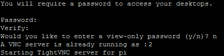
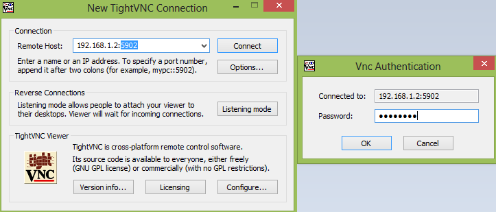

### 5.2.3 Iniciando o servidor e configurando uma senha

A primeira vez que executar o servidor digitando o código abaixo no terminal, irá pedir para definir uma senha de 8 dígitos. Esta é a senha utilizada para se conectar remotamente.

```bash
/usr/bin/tightvncserver
```

Quando o servidor começar, vai dizer que o desktop virtual foi configurado. Neste caso "_New 'X' desktop is raspberrypi:1_" mostra que o desktop é o virtual 1. É possível se conectar a esse Desktop virtual utilizando :1 no fim do endereço IP do cliente. Este número é o que irá ser configurado para a inicialização automática depois, sendo que para inicialização automática será o Desktop virtual :2.



Cada vez que se inicia o tightvncserver, ele captura o próximo Desktop disponível, que no nosso caso remoto automático será o 2, mas em outros casos, pode ser o 1. Quando for requerido uma senha durante a instalação, digite uma senha de 8 dígitos no terminal como, por exemplo, _12345678_. Essa senha será a mesma utilizada quando conectar no cliente Windows.

Para instalar o TightVNC no computador cliente Windows, basta baixá-lo em [TightVNC.com](www.tightvnc.com). Após instalar o cliente Windows, aparecerá a interface da Figura 12.



<center>Figura 12: TightVNC.</center>

Note que a porta VNC é 5902, ou seja, o Desktop virtual instalado será o 2. Ao clicar em **Connect**, basta digitar a mesma senha cadastrada na instalação no Pi (_12345678_ no nosso exemplo). Para modificar o Desktop virtual, digite ```tightvncserver``` no terminal SSH como usuário pi. Será mostrado qual o Desktop disponível para conexão no cliente Windows.
