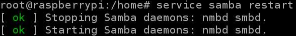
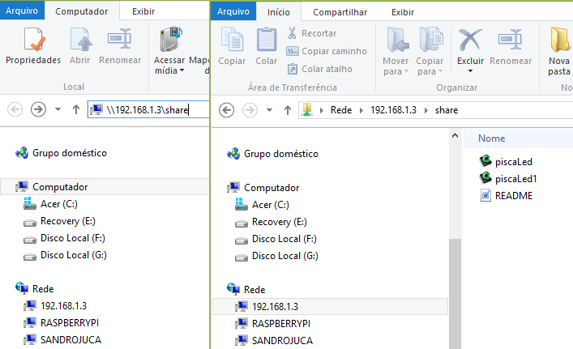

## 6.1 Instalando o SAMBA

<div class="warning">
Caso você tenha seguido os passos de [3.3 Instalação rápida dos programas necessários para as práticas da apostila](3.3 Instalação rápida dos programas necessários para as práticas da apostila.md), você pode pular essa subsessão
</div>

Para não ter que ficar usando o 'sudo' a cada comando digite:

```bash
sudo bash # ou 'sudo su'
```

Atualize a lista de pacotes e _mirror_ do apt-get usando o comando:

```bash
apt-get update
```

Aguarde. Essa operação pode levar vários minutos. Digite a seguinte linha de comando para baixar o SAMBA:

```bash
apt-get install samba samba-common-bin
```

Confirme a instalação quando solicitado.

Vamos configurar um compartilhamento, usaremos o sub-diretório home para isso.

Crie o sub-diretório share dentro do diretório home:

```bash
mkdir /home/share/
```

Dê permissões totais para sua pasta share:

```bash
cd /home
chmod 777 share
```

<div class="warning">
Note que esse tipo de permissão (777) pode comprometer a segurança do seu sistema. Utilizamos aqui somente para fins didáticos.
</div>

Crie uma cópia de segurança do arquivo de configurações original do samba. Com isso, em qualquer necessidade poderemos voltar às configurações originais:

```bash
cp /etc/samba/smb.conf /etc/samba/smb.conf.old
```

Edite o arquivo **/etc/samba/smb.conf**:

```bash
nano /etc/samba/smb.conf
```

Vá com o cursor até o final do arquivo **smb.conf** e insira as seguintes linhas:

```
[share]
comment = Laese Compartilhamento Geral
path = /home/share
create mask = 0777
directory mask = 0777
writable = true
security = share
browseable = true
public = no
```

Depois salvar o arquivo:
```
Ctrl+X
Yes
<Enter>
```

Com isso foi criado um compartilhamento chamado share que dará acesso irrestrito aos arquivos lá constantes utilizando o [Samba](http://www.samba.org).

Agora reinicie o serviço para que a nova configuração seja efetivada (Figura 13):

```bash
service samba restart
```



<center>
Figura 13: service samba restart.
</center>

Agora se o computador estiver no Windows, abra o Windows Explorer e na barra de endereços digite ```\\<endereço ip do Raspberry>\share```, por exemplo: ```\\192.168.1.3\share``` e adicione ou visualize arquivos compartilhados com o Raspberry (Figura 14).


<center>
Figura 14: Arquivos compartilhados na pasta _share_.
</center>


<center>
Figura 15: Arquivos presentes em /home/share.
</center>
