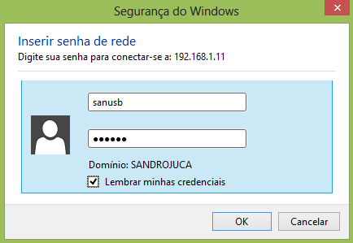

## 6.2 Criação de senha para acesso ao Samba

É importante criar uma senha de acesso à pasta _share_, de forma que somente o usuário autorizado poderá visualizar e trabalhar com os arquivos. O passo a passo é descrito a seguir:

Criar usuário para o Linux.

```bash
root@raspberrypi:/home/pi# adduser laese # Para remover: "userdel usuário"
Adding user ‘laese’ ...
Adding new group ‘laese’ (1002) ...
Adding new user ‘laese’ (1001) with group ‘laese’ ...
Creating home directory ‘/home/laese’ ...
Copying files from ‘/etc/skel’ ...
Enter new UNIX password: # Insira a senha ou <Enter> para usuário não possuir senha
Retype new UNIX password: # Repita a senha anterior ou <Enter> caso não tenha inserido uma senha

# Caso uma senha não tenha sido informada, será requisitado novamente a senha:
No password supplied
Enter new UNIX password:
Retype new UNIX password:
passwd: password updated successfully
Enter the new value, or press ENTER for the default
```

Vincular usuário criado a um novo usuário no Samba:

```bash
root@raspberrypi:/home/pi# smbpasswd -a laese
New SMB password: # Escolha a senha para o samba
Retype new SMB password: # Repita a senha
Added user laese.
```

```
root@raspberrypi:/home/pi#
Digte:
nano /etc/samba/smb.conf
```

Vá com o cursor até o final share e inclua:
```bash
[share]
# [...]
public=no # Observe que antes o acesso estava liberado, com a opção public=yes
valid user=laese # Caso seja usuário pi não é necessário essa linha
```

Reinicie o samba

```
root@raspberrypi:/home/pi/scripts# service samba restart
[ ok ] Stopping Samba daemons: nmbd smbd.
[ ok ] Starting Samba daemons: nmbd smbd.
```

Pronto. Já é possível entrar pelo Window Explorer e visualizar os arquivos compartilhados /home/share/. Se for a primeira vez, e for marcado “Lembrar minhas credenciais”, após o login e senha, o Explorer abrirá nas próximas vezes normalmente sem o pedido de senha.



Diretório compartilhado em: ```cd /home/share/```
Para trocar a senha do Samba, é possível digitar novamente  (```smbpasswd -a usuário```) e inserir a nova senha ou remover o usuário anterior (se não for o pi), inserir um novo usuário e senha (com ```addusr```) e reiniciar o Rpi (```reboot```) e o computador cliente.

Caso não se queira criar um usuário válido, é possível também utilizar o usuário válido padrão "pi". Para que o Samba saiba que o "pi" também é um usuário do servidor Samba, digite:

```bash
sudo smbpasswd -a pi
```

Então digite a senha padrão do usuário pi duas vezes (padrão: raspberry), ou outra senha caso a senha do usuário pi tenha sido alterada anteriormente pelo comando pi@raspberrypi: ~$ passwd ).

Depois digite:
```bash
nano /etc/samba/smb.conf
```

Vá com o cursor até o final de share e modifique o public (public=no):
```
[share]
…
public=no
```

Depois basta reiniciar, fechar o Explorer e, da próxima vez, o Samba pedirá a nova senha cadastrada pelo usuário pi.
