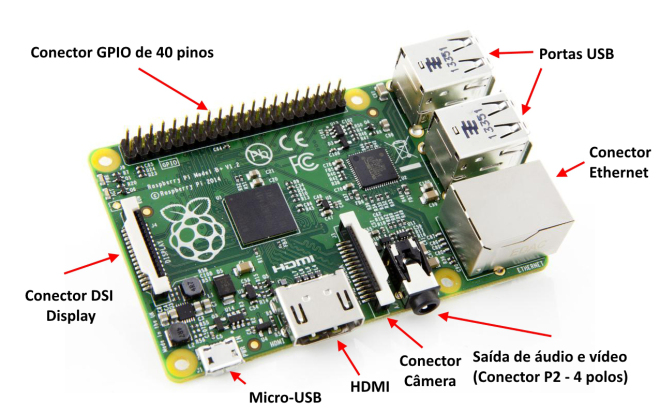

# Aplicações Práticas de Raspberry Pi com microcontroladores PIC

Aprenda de forma simples a gravação online de microcontroladores via Raspberry Pi

Grupo SanUSB

_Dedicamos este trabalho_

_a Deus, às nossas famílias, a todos_

_os IFCEanos, amigos, alunos e integrantes_

_do grupo SanUSB._

**Sumário**

1.INTRODUÇÃO 7

2.S.O. no Raspberry Pi 10

2.1 Raspbian 10

3.Instalação 11

3.1 Instalação do software 11

3.2 Formatar o SD Card (FAT ou FAT32 padrão) 11

3.3 Instalar o Sistema Operacional no cartão 12

[3.4 Raspberry Pi – Como fazer um backup do seu sistema 13](#641552765388041-_Toc449098141)

[3.5 Criação do arquivo de imagem do sistema 13](#641552765388041-_Toc449098142)

[3.6 Instalação do  arquivo de imagem no cartão 15](#641552765388041-_Toc449098143)

[3.7 Instalação rápida do Raspbian e programas iniciais necessários 16](#641552765388041-_Toc449098144)

4.Minibian (MINImal raspBIAN) 17

[4.1 Acesso Remoto SSH (Secure SHell) por linha de comando 18](export/minibian_minimal_raspbian.md#641552765388041-_Toc449098146)

[4.2 Acesso a um Raspberry remoto por interface gráfica 18](export/minibian_minimal_raspbian.md#641552765388041-_Toc449098147)

[4.3 Instalando o software do servidor TightVNC 18](export/minibian_minimal_raspbian.md#641552765388041-_Toc449098148)

[4.4 Iniciando o servidor e configurando uma senha 19](export/minibian_minimal_raspbian.md#641552765388041-_Toc449098149)

[4.5 Script de instalação automática do tightvnc para inicialização automática 20](export/minibian_minimal_raspbian.md#641552765388041-_Toc449098150)

[4.6 Mudar senha do VNC 21](export/minibian_minimal_raspbian.md#641552765388041-_Toc449098151)

[O VNC só aceita senha com oito caracteres, caso seja digitada uma senha com mais de oito caracteres o vnc irá considerar somente os oito primeiros. 21](export/minibian_minimal_raspbian.md#641552765388041-_Toc449098152)

[5.Descrevendo a instalação do servidor SAMBA 22](export/minibian_minimal_raspbian.md#641552765388041-_Toc449098153)

[5.1 Criar senha para acesso ao Samba 24](export/minibian_minimal_raspbian.md#641552765388041-_Toc449098154)

[5.2 Copiar arquivos do PC para o Raspberry Pi com Filezilla e vice-versa 27](export/minibian_minimal_raspbian.md#641552765388041-_Toc449098155)

6.Conhecendo/revendo os principais comandos Linux para usar no Raspberry Pi 27

[6.1 Listagem de Arquivos e Movimentação 27](export/minibian_minimal_raspbian.md#641552765388041-_Toc449098157)

[6.3 Navegação – Endereços absolutos 28](export/minibian_minimal_raspbian.md#641552765388041-_Toc449098158)

[6.4 Endereço relativo – Descer um nível 30](export/minibian_minimal_raspbian.md#641552765388041-_Toc449098159)

[6.5 Criação de diretórios 30](export/minibian_minimal_raspbian.md#641552765388041-_Toc449098160)

[6.6 Criação de arquivos 31](export/minibian_minimal_raspbian.md#641552765388041-_Toc449098161)

[6.7 Copiar arquivos 31](export/minibian_minimal_raspbian.md#641552765388041-_Toc449098162)

[6.8 Mover e renomear arquivos 31](export/minibian_minimal_raspbian.md#641552765388041-_Toc449098163)

[6.9 Listar e remover processos em execução 32](export/minibian_minimal_raspbian.md#641552765388041-_Toc449098164)

[7.PISCANDO UM LED COM O RASPBERRY utilizando ‘Wiringpi’ 32](export/minibian_minimal_raspbian.md#641552765388041-_Toc449098165)

[7.1 Comandos de entrada e saída no LXTerminal 35](export/minibian_minimal_raspbian.md#641552765388041-_Toc449098166)

[7.2 Resistores internos de pull-up e pull-down 36](export/minibian_minimal_raspbian.md#641552765388041-_Toc449098167)

[7.3 Comandos _shell_ para acionamento dos pinos 37](export/minibian_minimal_raspbian.md#641552765388041-_Toc449098168)

[7.4 Comandos WiringPi 38](export/minibian_minimal_raspbian.md#641552765388041-_Toc449098169)

[8.Modulação por largura de pulso PWM pela biblioteca Wiringpi 41](export/minibian_minimal_raspbian.md#641552765388041-_Toc449098170)

[8.1 Modulação por largura de pulso (PWM) por Hardware 41](export/minibian_minimal_raspbian.md#641552765388041-_Toc449098171)

[9.Comunicação serial entre um microcontrolador PIC e Raspberry Pi 43](export/minibian_minimal_raspbian.md#641552765388041-_Toc449098172)

9.1 Funções seriais WiringPi 44

9.2 Configuração serial do Raspberry Pi 46

9.3 Configurando manualmente a porta serial com minicom 46

[9.4 RTOS em um PIC de 8 bits com conversor A/D e comunicação serial 57](export/minibian_minimal_raspbian.md#641552765388041-_Toc449098176)

[10.Gravando o PIC via USB utilizando RPi 61](export/minibian_minimal_raspbian.md#641552765388041-_Toc449098177)

[11.Tutorial de Instalação da gravação de firmware em nuvem 65](export/minibian_minimal_raspbian.md#641552765388041-_Toc449098178)

[12.Interrupções com wiringPi 65](export/minibian_minimal_raspbian.md#641552765388041-_Toc449098179)

[13.Interrupções e Tarefas concorrentes com wiringPi 67](export/minibian_minimal_raspbian.md#641552765388041-_Toc449098180)

[13.1 PI_THREADS NO LINUX 67](export/minibian_minimal_raspbian.md#641552765388041-_Toc449098181)

[13.1.1Processamento simultâneo (multi-threading) 67](export/minibian_minimal_raspbian.md#641552765388041-_Toc449098182)

[13.2 Funções Auxiliares 71](export/minibian_minimal_raspbian.md#641552765388041-_Toc449098183)

[14.Biblioteca CURL 71](export/minibian_minimal_raspbian.md#641552765388041-_Toc449098184)

[14.1 Exemplos: Acessar um siste para post no LXTerminal 71](export/minibian_minimal_raspbian.md#641552765388041-_Toc449098185)

15.Referências 72

[16.Apêndices 73](export/minibian_minimal_raspbian.md#641552765388041-_Toc449098187)

[16.2Tunelamento SSH 76](export/minibian_minimal_raspbian.md#641552765388041-_Toc449098188)

[16.3 Configurando o WiFi no Raspberry Pi com USB dongle 78](export/minibian_minimal_raspbian.md#641552765388041-_Toc449098189)

[16.4 Raspberry como Servidor 78](export/minibian_minimal_raspbian.md#641552765388041-_Toc449098190)

[16.5 A instalação de um servidor web e transferência de um Website 79](export/minibian_minimal_raspbian.md#641552765388041-_Toc449098191)

[16.6 CURL no PHP 82](export/minibian_minimal_raspbian.md#641552765388041-_Toc449098192)

[16.7 Copiar arquivos do PC para o Raspberry Pi com Filezilla e vice-versa 82](export/minibian_minimal_raspbian.md#641552765388041-_Toc449098193)

[16.8 Dropbox no Raspberry 84](export/minibian_minimal_raspbian.md#641552765388041-_Toc449098194)

[16.8.1 Comandos: 85](export/minibian_minimal_raspbian.md#641552765388041-_Toc449098195)

[16.9 Banco de dados estruturado MySQL 88](export/minibian_minimal_raspbian.md#641552765388041-_Toc449098196)

[16.9.1 Conexão ao MySQL de um servidor online 90](export/minibian_minimal_raspbian.md#641552765388041-_Toc449098197)

[16.9.2 Comando do MySQL 92](export/minibian_minimal_raspbian.md#641552765388041-_Toc449098198)

[16.9.3 Atualizando o Raspberry Pi 93](export/minibian_minimal_raspbian.md#641552765388041-_Toc449098199)

[16.10 Instalando o MySQL Client 94](export/minibian_minimal_raspbian.md#641552765388041-_Toc449098200)

[16.11 Banco de dados estruturado SQlite 99](export/minibian_minimal_raspbian.md#641552765388041-_Toc449098201)

[16.12 Modificar o nome do Rpi 106](export/minibian_minimal_raspbian.md#641552765388041-_Toc449098202)

[16.13 Modificar a senha do Usuário pi 106](export/minibian_minimal_raspbian.md#641552765388041-_Toc449098203)

[16.14 Modificar data, hora e fuso horário do Rpi 106](export/minibian_minimal_raspbian.md#641552765388041-_Toc449098204)

[16.15 Configurar o teclado para uso local 108](export/minibian_minimal_raspbian.md#641552765388041-_Toc449098205)

[16.16 Criar, ler e escrever em um arquivo via Shell 108](export/minibian_minimal_raspbian.md#641552765388041-_Toc449098206)

[16.17 Simulação de Comunicação GPIO Raspberry usando php e mysql com raspian no VirtualBox 112](export/minibian_minimal_raspbian.md#641552765388041-_Toc449098207)

[16.18 Semáforo utilizando pinos GPIO do raspberry pi e MySql 118](export/minibian_minimal_raspbian.md#641552765388041-_Toc449098208)

[16.19 Controle WiFi de Robô móvel (motor CC) pelo Rpi via SSH 122](export/minibian_minimal_raspbian.md#641552765388041-_Toc449098209)

**Índice de Figuras**

Figura 1: Raspberry Pi. 7

Figura 2: Quatro modelos de Raspberry Pi. 9

Figura 3: Tela gerada pelo Raspberry Pi. 11

Figura 4: SD Formatter. 12

Figura 5: Win32DiskImager. 12

Figura 6: Confirmação de gravação da imagem no cartão SD. 13

Figura 7: Win32 Disk Imager. 14

Figura 8: Abrir local do arquivo. 14

Figura 9: Concluir backup. 15

Figura 10: Escrever imagem no cartão SD. 15

Figura 11: Minibian. 18

Figura 12: TightVNC. 20

Figura 13: service samba restart. 23

Figura 14: Arquivos compartilhados na pasta _share_. 24

Figura 15: Acesso ao Rpi. 24

Figura 16: Filezilla. 27

[Figura 17: Localização atual no Rpi. 28](export/minibian_minimal_raspbian.md#641552765388041-_Toc449098372)

[Figura 18: Arquivos locais. 28](export/minibian_minimal_raspbian.md#641552765388041-_Toc449098373)

[Figura 19: Raiz do Rpi. 28](export/minibian_minimal_raspbian.md#641552765388041-_Toc449098374)

[Figura 20: Diretórios Rpi. 29](export/minibian_minimal_raspbian.md#641552765388041-_Toc449098375)

[Figura 21: Diretórios Rpi. 30](export/minibian_minimal_raspbian.md#641552765388041-_Toc449098376)

[Figura 22: Pinos GPIO. 34](export/minibian_minimal_raspbian.md#641552765388041-_Toc449098377)

[Figura 23: Conexão de LED ao Rpi. 34](export/minibian_minimal_raspbian.md#641552765388041-_Toc449098378)

[Figura 24: Pinos GPIO. 34](export/minibian_minimal_raspbian.md#641552765388041-_Toc449098379)

[Figura 25: Conexão de botão ao Rpi. 36](export/minibian_minimal_raspbian.md#641552765388041-_Toc449098380)

[Figura 26: Wiring Pi. 39](export/minibian_minimal_raspbian.md#641552765388041-_Toc449098381)

[Figura 27:Pinos necessários para comunicação serial. 44](export/minibian_minimal_raspbian.md#641552765388041-_Toc449098382)

[Figura 28: Conexão entre o modem bluetooth e o Raspberry Pi. 44](export/minibian_minimal_raspbian.md#641552765388041-_Toc449098383)

[Figura 29: Serial Port Setup. 47](export/minibian_minimal_raspbian.md#641552765388041-_Toc449098384)

[Figura 30: Configurações no LXTerminal. 47](export/minibian_minimal_raspbian.md#641552765388041-_Toc449098385)

[Figura 31: Configurações no LXTerminal. 48](export/minibian_minimal_raspbian.md#641552765388041-_Toc449098386)

[Figura 32: Configurações no LXTerminal. 48](export/minibian_minimal_raspbian.md#641552765388041-_Toc449098387)

[Figura 33: Saindo do minicom. 49](export/minibian_minimal_raspbian.md#641552765388041-_Toc449098388)

[Figura 34: Ilustração da comunicação serial entre Pic e Rpi 49](export/minibian_minimal_raspbian.md#641552765388041-_Toc449098389)

[Figura 35: Prática em funcionamento, recebendo comandos bluetooth e enviando valores do potenciometro para a serial.. 59](export/minibian_minimal_raspbian.md#641552765388041-_Toc449098390)

[Figura 36: Conexão entre Rpi e PIC. 63](export/minibian_minimal_raspbian.md#641552765388041-_Toc449098391)

[Figura 37: Tunelamento SSH. 76](export/minibian_minimal_raspbian.md#641552765388041-_Toc449098392)

[Figura 38: Tunelamento SSH. 77](export/minibian_minimal_raspbian.md#641552765388041-_Toc449098393)

[Figura 39: Filezilla. 83](export/minibian_minimal_raspbian.md#641552765388041-_Toc449098394)

[Tabela 1: Tabela user do MySQL. 89](export/minibian_minimal_raspbian.md#641552765388041-_Toc449098395)

[Figura 40: Database. 93](export/minibian_minimal_raspbian.md#641552765388041-_Toc449098396)

[Figura 41: Tabelas do banco MySQL. 93](export/minibian_minimal_raspbian.md#641552765388041-_Toc449098397)

Figura 42: Tabela exemplo banco de dados. 101

[Figura 43: Tela inicial do projeto para login na ferramenta. 116](export/minibian_minimal_raspbian.md#641552765388041-_Toc449098399)

[Figura 44:Sistema raspbian emulado no Oracle Virtual Box com 512 de memória ram. 117](export/minibian_minimal_raspbian.md#641552765388041-_Toc449098400)

[Figura 45:Pasta www do apache com os arquivos necessários para funcionamento do projeto. 117](export/minibian_minimal_raspbian.md#641552765388041-_Toc449098401)

[Figura 46: Tela principal do projeto, onde pode-se comandar os leds através de botões. 118](export/minibian_minimal_raspbian.md#641552765388041-_Toc449098402)

[Figura 47: Prática em funcionamento com protoboard e raspberry pi 2 conectado à internet. 122](export/minibian_minimal_raspbian.md#641552765388041-_Toc449098403)

**INTRODUÇÃO**

O Raspberry Pi, considerado o menor computador do mundo, possui o tamanho de um cartão de crédito, conexões USB para conectar o teclado e o mouse utilizado em computadores de mesa. É possível conectá-lo a TVs com saída RCA ou HDMI, como pode ser visto na Figura 1 juntamente com a descrição das demais conexões. Além destas vantagens, pode-se destacar o baixo custo do hardware, além do custo zero do software embarcado, baseado em Linux.

Figura 1: Raspberry Pi.

Todo o hardware é integrado em uma única placa. O principal objetivo dos desenvolvedores foi promover o ensino em Ciência da Computação básica em escolas, principalmente públicas. É um pequeno dispositivo que permite que pessoas de todas as idades possam explorar a computação para aprender a programar em linguagens como C e Python. É capaz de desenvolver tudo que um computador convencional faz como navegar na internet, reproduzir vídeos de alta definição, fazer planilhas, processar textos, brincar com jogos, além de processar tarefas mais complexas como monitoramento online. Dessa forma, é utilizado por crianças de todo o mundo para aprender como funcionam os computadores, como manipular o mundo eletrônico ao redor deles, e como programar. Versões do Raspberry Pi com vídeo-aulas e outros materiais de treinamento poderiam ser úteis em projetos de inclusão digital, já que o baixo custo permitiria não apenas que eles fossem usados em laboratórios, como também fornecidos aos estudantes para aprender programação em domicílio juntamente com materiais didáticos.

Além disto, o Rpi tem a capacidade de interagir com o mundo exterior, e tem sido usado em uma ampla gama de projetos digitais, de máquinas de música e diversos outros projetos onde a placa trabalha em conjunto com um microcontrolador, que nesta aplicação, é o PIC, através da placa da Ferramenta SanUSB.

O computador Rpi utilizado (versão B+) é baseado em um system on a chip (SoC) Broadcom BCM2835 [Broadcom 2015] que inclui um processador ARM1176JZF-S de 700 MHz com uma GPU VideoCore IV,9 operando a 250 MHz e 512 MB de memória RAM em sua última revisão. Apesar da frequência de processamento (clock) parecer baixa em comparação às GPUs para desktops, esta é uma GPU que oferece um poder de processamento superior à Power VR SGX 535 usada no iPhone e em outros dispositivos, inclusive com suporte à decodificação de vídeos 1080p via hardware. A placa não inclui uma memória não-volátil, como um disco rígido, mas possui uma entrada de cartão microSD para armazenamento de dados.

A alimentação elétrica fica por conta de uma porta micro-USB localizada ao lado do cartão de memória. Esta foi escolhida para simplificar e baratear o projeto, já que permite que ele seja alimentado por qualquer carregador de celular (ou por um carregador veicular ligado a uma bateria de 12V e/ou placa solar) e permite que os 5V recebidos sejam enviados diretamente para componentes que usam 5V, como dispositivos USB plugados e a porta HDMI.

Embora possua duas portas USB (no modelo B), o Rpi é limitado em relação à quantidade de energia que pode ser fornecida a dispositivos conectados à porta USB, já que ele mesmo também é alimentado através de uma porta USB. Os conectores são destinados a dispositivos como teclados e mouses, bem como pendrives e outros dispositivos de baixo consumo. Para usar dispositivos de maior consumo, como HDs externos, é necessário usar um extensor (hub) USB com alimentação própria. Mesmo placas WiFi podem ser um problema, demandando que a fonte de alimentação seja capaz de fornecer pelo menos 700 mA. Normalmente é necessária uma fonte coma a capacidade maior que 1.500 mA, quando é utilizada a interface Ethernet. É possível visualizar na Figura 2 as especificações de quatro modelos de Rpi disponíveis. O modelo mais recente (2, B), apresenta as mesmas conexões do B+, porém com 1 GB de RAM e processador de 900 MHz.

Figura 2: Quatro modelos de Raspberry Pi.

Diferente de um PC, o Rpi não possui BIOS ou Setup. Em vez disso, todas as configurações relacionadas ao hardware e ao processo de boot são feitas em um arquivo de texto localizado no diretório raiz do cartão, o "config.txt", que engloba muitas opções que em um PC estariam disponíveis no Setup, incluindo a frequência de operação do processador, que na maioria dos casos pode ser aumentado para até 900 MHz. Mesmo em overclock, o SoC aquece pouco, o que permite o funcionamento sem dissipador.

Embora venha sem sistema operacional, o Rpi é compatível com várias distribuições Linux, incluindo o Debian (Raspbian), Arch Linux e Fedora. Diferente do que se tem na plataforma PC, não existe uma imagem única para dispositivos ARM, já que a plataforma carece de BIOS, enumeração de dispositivos plug-and-play e outras funções, o que dificulta a detecção do hardware automaticamente durante o boot. Vale salientar que a gravação via USB de microcontroladores PIC proposta nesse trabalho é baseada no protocolo HID (Human Interface Device) e este protocolo plug-and-play é reconhecido automaticamente no boot.

Nos processadores ARM é necessário que uma imagem específica do sistema operacional seja desenvolvida para o dispositivo. Dessa forma, uma das vantagens é que vários voluntários já estão fazendo isso, disponibilizando imagens que estão disponíveis para download [Raspberry 2015]. A instalação destas imagens é simples, consistindo apenas em gravar a imagem no cartão SD usando um software ou outro utilitário de cópia bit a bit, inserir o cartão SD no Rpi e reiniciar o sistema operacional.

Para prover comunicação entre o Rpi e computadores é possível conectá-lo em rede utilizando o padrão Ethernet, ou através de um _dongle Wifi_ ou realizar comunicação serial que utiliza a porta serial (UART).

S.O. no Raspberry Pi

Sistemas Operacionais (S.O.) podem ser definidos como uma coleção de programas que atua como uma interface entre os programas do usuário e o hardware. Sua maior finalidade é proporcionar um ambiente em que o usuário de um microsistema possa executar programas no hardware de forma eficiente. São atribuições de um SO:

1. Gerenciar recursos e dispositivos I/O;

2. Oferecer uma simples interface para aplicativos e usuários.

Dentre os sistemas operacionais com Raspberry Pi, o mais utilizado é o Raspbian (necessário cartão SD de 4 GB). Para projetos de eletrônica, robótica, servidores e outros já que deixa livres no Raspberry Pi o máximo de recursos possível como memória, processador e consumo de corrente, está disponível também o Minibian **(**MINImal raspBIAN) que cabe em um cartão microSD de apenas 1 GB.

*   1.  Raspbian

O Raspbian é um dos sistemas operacionais oficiais do Rpi distribuído pela [Raspberry Pi Foundation](http://www.raspberrypi.org/). Esta é a distribuição ideal para quem tem menos conhecimentos dos sistemas Linux ou simplesmente necessite de um sistema operacional pronto. O Raspbian é um sistema quase completo, já que vem com diversas aplicações pré-instaladas, os drivers mais usuais, ferramentas para facilitar algumas configurações necessárias, entre outros. Muitas aplicações e módulos dedicados à programação já vêm incluídos na imagem do Raspbian, bastando iniciar o sistema para acessá-las. Para iniciantes com o Rpi, que desejam experimentar as potencialidades ou começar a programar e desenvolver projetos de sistemas embarcados, o Raspbian é o mais recomendado. A Figura 3 mostra a tela gerada pelo Raspberry para interface com o usuário.

Figura 3: Tela gerada pelo Raspberry Pi.

Instalação

Para começar as práticas com o Raspberry Pi, segue uma lista do material necessário.

*   ****Raspberry Pi (modelo B+ ou 2, com 4 USB e 1 Ethernet)****
*   ****Fonte de Alimentação: 5 V / com mínimo de 1500 mA**** 
*   ****Cartão SD ou Micro SD (mínimo de 4GB****)

*   1.  Instalação do software

Após fazer o download do sistema operacional Raspbian, instale o **Win32DiskImager** e transfira a imagem do sistema operacional para SD card.

*   1.  Formatar o SD Card (FAT ou FAT32 padrão)

Normalmente, o SD card já vem de fabrica formatado no padrão FAT32 não sendo necessário fomratá-lo novamente. Caso não seja, siga os passos a seguir. É possível também realizar a formatação no padrão FAT32 clicando com o botão direito sobre o SD card e selecionando Formatar.

*   Insira o cartão no leitor do seu computador;
*   Execute o **SD Formatter **(ver** **Figura 4****)**.**

Figura 4: SD Formatter.

*   Verifique se a letra em “Drive” corresponde ao cartão que deseja formatar;

**AVISO:** A formatação irá eliminar todos os dados existentes no drive selecionado! Assegure-se que escolhe a drive correta.

*   Clique no botão “Option” e em “FORMAT SIZE ADJUSTMENT” e selecione “ON”;
*   Clique no botão “Format” e aguarde a conclusão do processo.

###  Instalar o Sistema Operacional no cartão {#instalar-o-sistema-operacional-no-cart-o}

*   Execute como administrador clicando com botão direito no ícone **Win32DiskImager **(ver** **Figura 5****)**.**

Figura 5: ****Win32DiskImager.****

*   Em “Device”, assegure-se que seleciona a letra correspondente ao seu cartão SD;
*   Clique no ícone com a imagem de uma pasta  e escolha o arquivo .**img** dentro da pasta para onde extraiu o sistema operacional no passo 1 deste tutorial;
*   Clique no botão “Write”, aceite o aviso na janela seguinte e aguarde até terminar (ver Figura 6). Este processo irá levar alguns minutos.

Figura 6: Confirmação de gravação da imagem no cartão SD.

Parabéns! O seu cartão está agora pronto para o **Raspberry Pi**.

*   1.  Raspberry Pi – Como fazer um backup do seu sistema

Depois de ter o seu **Raspberry Pi** com o sistema operacional ajustado de acordo com as suas necessidades e preferências, a última coisa que vai querer é ter que recomeçar do zero caso falhe o cartão SD, por exemplo.

 Felizmente é muito fácil fazer uma cópia de segurança completa do cartão e repô-la sempre que necessário.

Em poucos passos vamos criar um arquivo com a imagem do cartão que inclui todo o sistema operacional e mostrar-lhe como pode facilmente utilizar essa imagem para replicar o sistema noutros **Raspberry Pi** ou recuperar o seu de um ‘acidente’.

Para este tutorial vamos utilizar um PC com sistema operacional Windows e o programa grátis “Win32 Disk Imager”.

[http://sourceforge.net/projects/win32diskimager/](http://sourceforge.net/projects/win32diskimager/)

*   1.  ****Criação do arquivo de imagem do sistema****

- Se ainda não instalou o Win32 Disk Imager faça-o agora clicando no instalador.

 - Coloque o cartão com o sistema operacional do seu **Raspberry Pi** no leitor de cartões e ligue ao PC.

 - Inicie o Win32 Disk Imager, clicando com o botão direito no ícone e executando como administrador. A partir daí irá susgir a tela inicial como ilustrado na Figura 7.

Figura 7: Win32 Disk Imager.

- Em “_Device_” selecione a letra correspondente ao seu cartão SD do qual quer fazer backup.

 - Clique no ícone com uma pasta , selecione uma localização para guardar o arquivo a ser criado, atribua-lhe um nome e clique em “_Abrir_“ (Figura 8).

Figura 8: Abrir local do arquivo.

 – Finalmente clique no botão “Read” (Figura 9), confirme e aguarde o processo ser concluído.

Figura 9: Concluir backup.

- Abra a pasta que selecionou para guardar o backup e confirme que lá se encontra o arquivo criado.

*   1.  ****Instalação do  arquivo de imagem no cartão****

A  instalação de arquivo de imagem criado através deste método pode ser feita tal como mostrámos no artigo “[_Raspberry Pi – Como instalar o sistema operacional_](http://faciltek.com/raspberry-pi-como-instalar-o-sistema-operativo/)“.

Vamos relembrar rapidamente:

- Insira o cartão SD **formatado** no leitor do seu PC.

 - Inicie o Win32 Disk Imager.

 - Em “_Device_” selecione **cuidadosamente** a letra correspondente ao seu cartão SD.

 - Clique no ícone com uma pasta , selecione a localização onde se encontra o arquivo com a imagem a instalar e clique em “_Abrir_“.

- Clique no botão “_Write_” (Figura 10). 

Figura 10: Escrever imagem no cartão SD.

*   1.  ****Instalação rápida do Raspbian e programas iniciais necessários****

Após baixar o Raspbian em [https://www.raspberrypi.org/downloads/raspbian/](https://www.raspberrypi.org/downloads/raspbian/) , coloque o SD Card no computador e instale a imagem no SDcard com o Win32DiskImager (não é necessário formatar). Depois basta inserí-lo no Rpi e seguir a sequência básica:

- Conectar o Rpi na rede (network), Abrir o terminal SSH putty e digitar o IP do Rpi.

- Após entrar no terminal shell, basta digitar:

| **_sudo su_**(entrar como root) |
| --- |

Pronto. Será instalado automaticamente todos os programas iniciais necessários. Recomendo que façam em casa. Caso a rede esteja muito lenta pode ocorrer a falha de instalação em algum dos programas. Abaixo o script _SanUSBlink.sh_.

| _#!/usr/bin/env bash_ |
| --- |