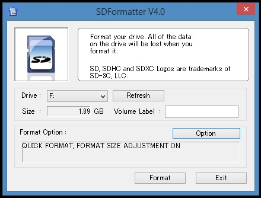
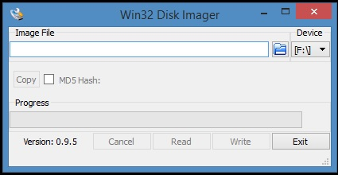
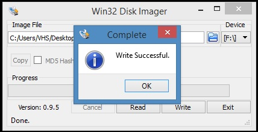
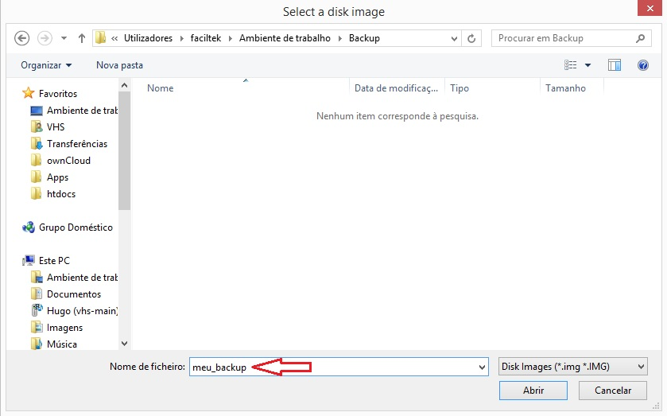
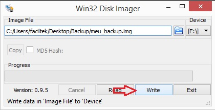

# Instalação

## Material necessário

Para começar as práticas com o Raspberry Pi, segue uma lista do material necessário.

 * Raspberry Pi (modelo B+, 2, 3, ou outro que contenha 4 USB e 1 Ethernet)
 * Fonte de Alimentação: 5 V / com mínimo de 1500 mA
 * Cartão SD ou Micro SD (mínimo de 4GB)
 * Imagem do Raspbian obtido a partir do site do [Raspberry Fondation](https://www.raspberrypi.org/downloads/)

## Instalação do software

Após fazer o download do Sistema Operacional Raspbian, instale o **Win32DiskImager** e transfira a imagem do sistema operacional para SD card.

### Formatar o SD Card (FAT ou FAT32 padrão)

Normalmente, o SD card já vem de fabrica formatado no padrão FAT32 não sendo necessário fomratá-lo novamente. Caso não seja, siga os passos a seguir. É possível também realizar a formatação no padrão FAT32 clicando com o botão direito sobre o SD card e selecionando Formatar.

*   Insira o cartão no leitor do seu computador;
*   Execute o **SD Formatter **(ver** **Figura 4****)**.**


<center>Figura 4: SD Formatter.</center>

*   Verifique se a letra em “Drive” corresponde ao cartão que deseja formatar;

**AVISO:** A formatação irá eliminar todos os dados existentes no drive selecionado! Assegure-se que escolhe a drive correta.

*   Clique no botão “Option” e em “FORMAT SIZE ADJUSTMENT” e selecione “ON”;
*   Clique no botão “Format” e aguarde a conclusão do processo.

###  Instalar o Sistema Operacional no cartão

*   Execute como administrador clicando com botão direito no ícone **Win32DiskImager **(ver** **Figura 5****)**.**



Figura 5: ****Win32DiskImager.****

*   Em “Device”, assegure-se que seleciona a letra correspondente ao seu cartão SD;
*   Clique no ícone com a imagem de uma pasta  e escolha o arquivo .**img** dentro da pasta para onde extraiu o sistema operacional no passo 1 deste tutorial;
*   Clique no botão “Write”, aceite o aviso na janela seguinte e aguarde até terminar (ver Figura 6). Este processo irá levar alguns minutos.



Figura 6: Confirmação de gravação da imagem no cartão SD.

Parabéns! O seu cartão está agora pronto para o **Raspberry Pi**.

### Fazendo backup do seu sistema

Depois de ter o seu **Raspberry Pi** com o sistema operacional ajustado de acordo com as suas necessidades e preferências, a última coisa que vai querer é ter que recomeçar do zero caso falhe o cartão SD, por exemplo.

 Felizmente é muito fácil fazer uma cópia de segurança completa do cartão e repô-la sempre que necessário.

Em poucos passos vamos criar um arquivo com a imagem do cartão que inclui todo o sistema operacional e mostrar-lhe como pode facilmente utilizar essa imagem para replicar o sistema noutros **Raspberry Pi** ou recuperar o seu de um ‘acidente’.

Para este tutorial vamos utilizar um PC com sistema operacional Windows e o programa grátis “Win32 Disk Imager”.

[http://sourceforge.net/projects/win32diskimager/](http://sourceforge.net/projects/win32diskimager/)

#### Criação do arquivo de imagem do sistema

- Se ainda não instalou o Win32 Disk Imager faça-o agora clicando no instalador.

 - Coloque o cartão com o sistema operacional do seu **Raspberry Pi** no leitor de cartões e ligue ao PC.

 - Inicie o Win32 Disk Imager, clicando com o botão direito no ícone e executando como administrador. A partir daí irá susgir a tela inicial como ilustrado na Figura 7.


Figura 7: Win32 Disk Imager.

- Em “_Device_” selecione a letra correspondente ao seu cartão SD do qual quer fazer backup.

 - Clique no ícone com uma pasta , selecione uma localização para guardar o arquivo a ser criado, atribua-lhe um nome e clique em “_Abrir_“ (Figura 8).



Figura 8: Abrir local do arquivo.

 – Finalmente clique no botão “Read” (Figura 9), confirme e aguarde o processo ser concluído.


Figura 9: Concluir backup.

- Abra a pasta que selecionou para guardar o backup e confirme que lá se encontra o arquivo criado.

#### Instalação do arquivo de imagem no cartão

A  instalação de arquivo de imagem criado através deste método pode ser feita tal como mostrámos no artigo “[_Raspberry Pi – Como instalar o sistema operacional_](http://faciltek.com/raspberry-pi-como-instalar-o-sistema-operativo/)“.

Vamos relembrar rapidamente:

- Insira o cartão SD **formatado** no leitor do seu PC.

 - Inicie o Win32 Disk Imager.

 - Em “_Device_” selecione **cuidadosamente** a letra correspondente ao seu cartão SD.

 - Clique no ícone com uma pasta , selecione a localização onde se encontra o arquivo com a imagem a instalar e clique em “_Abrir_“.

- Clique no botão “_Write_” (Figura 10). 



Figura 10: Escrever imagem no cartão SD.

*   1.  ****Instalação rápida do Raspbian e programas iniciais necessários****

Após baixar o Raspbian em [https://www.raspberrypi.org/downloads/raspbian/](https://www.raspberrypi.org/downloads/raspbian/) , coloque o SD Card no computador e instale a imagem no SDcard com o Win32DiskImager (não é necessário formatar). Depois basta inserí-lo no Rpi e seguir a sequência básica:

- Conectar o Rpi na rede (network), Abrir o terminal SSH putty e digitar o IP do Rpi.

- Após entrar no terminal shell, basta digitar:

```bash
# Entrar como root
sudo su 
```

Pronto. Será instalado automaticamente todos os programas iniciais necessários. Atente-se que em casos aonde a rede esteja oscilando existe a possibilidade de falha de instalação em algum dos programas. Abaixo o script_SanUSBlink.sh.

| _#!/usr/bin/env bash_ |
| --- |