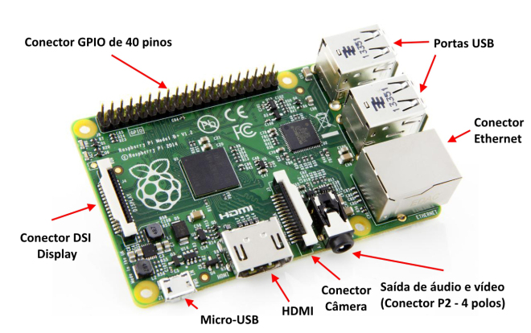
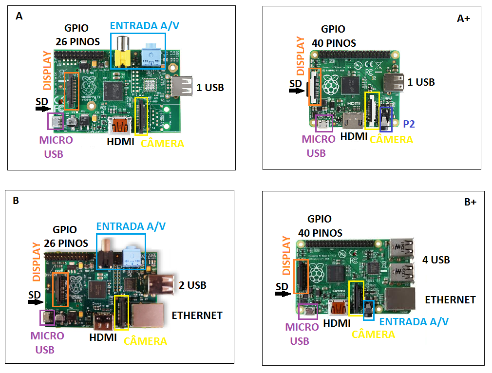

# Introdução

O Raspberry Pi, em sua época de lançamento considerado o menor computador do mundo, possui o tamanho de um cartão de crédito, conexões USB para conectar o teclado e o mouse utilizado em computadores de mesa. É possível conectá-lo a TVs com saída RCA ou HDMI, como pode ser visto na Figura 1 juntamente com a descrição das demais conexões. Além destas vantagens, pode-se destacar o baixo custo do hardware, além do custo zero do software embarcado, baseado em Linux.

Figura 1: Raspberry Pi.

Todo o hardware é integrado em uma única placa. O principal objetivo dos desenvolvedores foi promover o ensino em Ciência da Computação básica em escolas, principalmente públicas. É um pequeno dispositivo que permite que pessoas de todas as idades possam explorar a computação para aprender a programar em linguagens como C e Python. É capaz de desenvolver tudo que um computador convencional faz como navegar na internet, reproduzir vídeos de alta definição, fazer planilhas, processar textos, brincar com jogos, além de processar tarefas mais complexas como monitoramento online. Dessa forma, é utilizado por crianças de todo o mundo para aprender como funcionam os computadores, como manipular o mundo eletrônico ao redor deles, e como programar. Versões do Raspberry Pi com vídeo-aulas e outros materiais de treinamento poderiam ser úteis em projetos de inclusão digital, já que o baixo custo permitiria não apenas que eles fossem usados em laboratórios, como também fornecidos aos estudantes para aprender programação em domicílio juntamente com materiais didáticos.

Além disto, o Rpi tem a capacidade de interagir com o mundo exterior, e tem sido usado em uma ampla gama de projetos digitais, de máquinas de música e diversos outros projetos onde a placa trabalha em conjunto com um microcontrolador, que nesta aplicação, é o PIC, através da placa da Ferramenta SanUSB.

O computador Rpi utilizado (versão B+) é baseado em um system on a chip (SoC) Broadcom BCM2835 [Broadcom 2015] que inclui um processador ARM1176JZF-S de 700 MHz com uma GPU VideoCore IV,9 operando a 250 MHz e 512 MB de memória RAM em sua última revisão. Apesar da frequência de processamento (clock) parecer baixa em comparação às GPUs para desktops, esta é uma GPU que oferece um poder de processamento superior à Power VR SGX 535 usada no iPhone e em outros dispositivos, inclusive com suporte à decodificação de vídeos 1080p via hardware. A placa não inclui uma memória não-volátil, como um disco rígido, mas possui uma entrada de cartão microSD para armazenamento de dados.

A alimentação elétrica fica por conta de uma porta micro-USB localizada ao lado do cartão de memória. Esta foi escolhida para simplificar e baratear o projeto, já que permite que ele seja alimentado por qualquer carregador de celular (ou por um carregador veicular ligado a uma bateria de 12V e/ou placa solar) e permite que os 5V recebidos sejam enviados diretamente para componentes que usam 5V, como dispositivos USB plugados e a porta HDMI.

Embora possua duas portas USB (no modelo B), o Rpi é limitado em relação à quantidade de energia que pode ser fornecida a dispositivos conectados à porta USB, já que ele mesmo também é alimentado através de uma porta USB. Os conectores são destinados a dispositivos como teclados e mouses, bem como pendrives e outros dispositivos de baixo consumo. Para usar dispositivos de maior consumo, como HDs externos, é necessário usar um extensor (hub) USB com alimentação própria. Mesmo placas WiFi podem ser um problema, demandando que a fonte de alimentação seja capaz de fornecer pelo menos 700 mA. Normalmente é necessária uma fonte coma a capacidade maior que 1.500 mA, quando é utilizada a interface Ethernet. É possível visualizar na Figura 2 as especificações de quatro modelos de Rpi disponíveis. O modelo mais recente (2, B), apresenta as mesmas conexões do B+, porém com 1 GB de RAM e processador de 900 MHz.

Figura 2: Quatro modelos de Raspberry Pi.

Diferente de um PC, o Rpi não possui BIOS ou Setup. Em vez disso, todas as configurações relacionadas ao hardware e ao processo de boot são feitas em um arquivo de texto localizado no diretório raiz do cartão, o "config.txt", que engloba muitas opções que em um PC estariam disponíveis no Setup, incluindo a frequência de operação do processador, que na maioria dos casos pode ser aumentado para até 900 MHz. Mesmo em overclock, o SoC aquece pouco, o que permite o funcionamento sem dissipador.

Embora venha sem sistema operacional, o Rpi é compatível com várias distribuições Linux, incluindo o Debian (Raspbian), Arch Linux e Fedora. Diferente do que se tem na plataforma PC, não existe uma imagem única para dispositivos ARM, já que a plataforma carece de BIOS, enumeração de dispositivos plug-and-play e outras funções, o que dificulta a detecção do hardware automaticamente durante o boot. Vale salientar que a gravação via USB de microcontroladores PIC proposta nesse trabalho é baseada no protocolo HID (Human Interface Device) e este protocolo plug-and-play é reconhecido automaticamente no boot.

Nos processadores ARM é necessário que uma imagem específica do sistema operacional seja desenvolvida para o dispositivo. Dessa forma, uma das vantagens é que vários voluntários já estão fazendo isso, disponibilizando imagens que estão disponíveis para download [Raspberry 2015]. A instalação destas imagens é simples, consistindo apenas em gravar a imagem no cartão SD usando um software ou outro utilitário de cópia bit a bit, inserir o cartão SD no Rpi e reiniciar o sistema operacional.

Para prover comunicação entre o Rpi e computadores é possível conectá-lo em rede utilizando o padrão Ethernet, ou através de um _dongle Wifi_ ou realizar comunicação serial que utiliza a porta serial (UART).